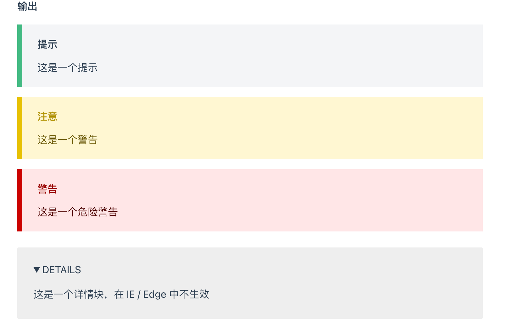

### 正则表达式，替换路径路径

因为 vue 解析相对路径，所以要以 `./` 开头路径才可以被 vue 替换

```
!\[(.*?)\]\((?!\.\/)(.*?\.assets/.*\.(png|jpg))\)
```

```

```

::: tip
这是一个提示
:::

::: warning
这是一个警告
:::

::: danger
这是一个危险警告
:::

::: details
这是一个详情块，在 IE / Edge 中不生效
:::


