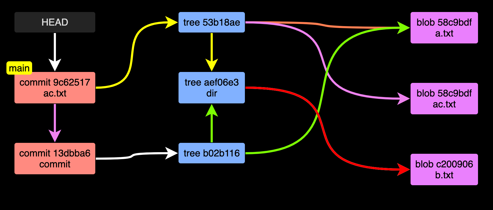
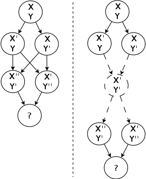

# Git 原理

## Git 概念


-   Workspace：工作区
-   Index / Stage：暂存区
-   Repository：本地仓库
-   Remote：远程仓库


## Git 的工作原理

Git 是一个**基于快照的文件版本管理系统**。

我们对文件的每次修改，Git 都会帮我们计算一个 hash 值，然后将内容写入到以这个 hash 值命名的文件中。

当我们 commit 修改之后，实际 commit 对应的对象保存了：提交信息和上次提交的hash 值，本次提交对应的对象。




[Git Graph: git-graph.harshkapadia.me](https://git-graph.harshkapadia.me/) 生成以上图片

`.git/objects` 为 git 相关对象保存的地方。

```shell
.git/objects
├── 13
│   └── dbba697fb437e53017aa604ad01f917d00fc33
├── 53
│   └── b18ae7196672c11ef2a9c9b8477b597487ad77
├── 58
│   └── c9bdf9d017fcd178dc8c073cbfcbb7ff240d6c
├── 9c
│   └── 62517b0d01486e69033dae6dc65503cd808f96
├── ae
│   └── f06e3d27cc6b17730daf473499ab58b68e772d
├── b0
│   └── 2b1164ed5a571b723cb25d978780b15d826d62
├── c2
│   └── 00906efd24ec5e783bee7f23b5d7c941b0c12c
├── info
└── pack
```


### 初始化仓库

```shell
mkdir git-yuanli && cd git-yuanli && git init
echo '111' > a.txt
mkdir dir && echo '222' > dir/b.txt
git add a.txt dir/b.txt
```


### 查看 git 保存的 object

每次我们当我们执行 `git add` 的时候，实际上 Git 会对我们 add 的文件进行 hash 计算，并将内容写到这个 hash 值命名的文件中。

```shell
tree .git/objects
.git/objects
├── 58
│   └── c9bdf9d017fcd178dc8c073cbfcbb7ff240d6c
├── c2
│   └── 00906efd24ec5e783bee7f23b5d7c941b0c12c
├── info
└── pack
```

```shell
// 计算 hash 值
git hash-object a.txt // 58c9bdf9d017fcd178dc8c073cbfcbb7ff240d6c
git hash-object b.txt // c200906efd24ec5e783bee7f23b5d7c941b0c12c

// 查看对象内容
git cat-file -p 58c9bdf9d017fcd178dc8c073cbfcbb7ff240d6c # 111
git cat-file -p c200906efd24ec5e783bee7f23b5d7c941b0c12c # 222

// 查看对象类型
git cat-file -t 58c9bdf9d017fcd178dc8c073cbfcbb7ff240d6c # blob
git cat-file -t c200906efd24ec5e783bee7f23b5d7c941b0c12c # blob
```


### Git commit

Git commit 也会生成一个对象。

```shell
git commit -m 'commit'

tree .git/objects

.git/objects
├── 13
│   └── dbba697fb437e53017aa604ad01f917d00fc33
├── 58
│   └── c9bdf9d017fcd178dc8c073cbfcbb7ff240d6c
├── ae
│   └── f06e3d27cc6b17730daf473499ab58b68e772d
├── b0
│   └── 2b1164ed5a571b723cb25d978780b15d826d62
├── c2
│   └── 00906efd24ec5e783bee7f23b5d7c941b0c12c
├── info
└── pack


git cat-file -p aef06e3d27cc6b17730daf473499ab58b68e772d # b.txt
git cat-file -t aef06e3d27cc6b17730daf473499ab58b68e772d # tree

git cat-file -p b02b1164ed5a571b723cb25d978780b15d826d62
100644 blob 58c9bdf9d017fcd178dc8c073cbfcbb7ff240d6c	a.txt
040000 tree aef06e3d27cc6b17730daf473499ab58b68e772d	dir
git cat-file -t b02b1164ed5a571b723cb25d978780b15d826d62 # tree


git cat-file -t 13dbba697fb437e53017aa604ad01f917d00fc33 # commit
git cat-file -p 13dbba697fb437e53017aa604ad01f917d00fc33
Found existing alias for "git". You should use: "g"
tree b02b1164ed5a571b723cb25d978780b15d826d62
author zhangpanqin <zhangpanqin@outlook.com> 1690645464 +0800
committer zhangpanqin <zhangpanqin@outlook.com> 1690645464 +0800

commit


```

综合以上，我们可以看出，git object 有三种类型，commit，tree，blob。

commit 对象保存： 提交信息，对应提交的 tree 以及上一次提交的 commit hash 值。Git 根据 tree 可以查询到 blob，然后就可以知道本次提交的所有内容了。

```shell
echo '111' > ac.txt
git add ac.txt
git commit -m 'ac.txt'
git cat-file -p 9c62517b0d01486e69033dae6dc65503cd808f96
tree 53b18ae7196672c11ef2a9c9b8477b597487ad77
parent 13dbba697fb437e53017aa604ad01f917d00fc33
author zhangpanqin <zhangpanqin@outlook.com> 1690646057 +0800
committer zhangpanqin <zhangpanqin@outlook.com> 1690646057 +0800

ac.txt
```

在 Git 仓库里面，HEAD、分支、普通的 Tag 可以简单的理解成是一个指针，指向对应 commit 的 hash 值。

`parent` 可能不止一个。

```shell
cat .git/HEAD # ref: refs/heads/main
cat .git/refs/heads/main # 9c62517b0d01486e69033dae6dc65503cd808f96
```


## Git 递归三路合并

Git 是基于文本文件逐行比较来做合并的。

```shell
    A---B---C topic
    /
D---E---F---G master
```


Git 使用 `递归三路合并` 算法将两个分支代码合并（git rebase，git merge）。


### 三路合并

了解 `递归三路合并` 之前，我们先了解一下 `三路合并`。

比如 topic 和 master 合并，C commit 和 G commit  合并, 找到 C 和 G 父 commit E。

三路合并将基于基线 E , 来比较 C 和 G 来确定代码的最终结果。git 算法无法解决的冲突，会提示我们解决。

文件内容是同一行内容，比如 a.js 这个文件的内容如下：

基线 E 中只有一行（第一行）内容：小明，

在 Commit C 只有一行（第一行）内容 ：小明，

在 Commit G只有一行（第一行）内容 ： 小明

a.js 合并之后内容是不会变化的。

如果提交改的行数不一样，Git 会给我做合并。

| 文件名 | 基线 E         | Commit C          | Commit G        | 结果                         |
| ------ | -------------- | ----------------- | --------------- | ---------------------------- |
| a.js   | 小明           | 小明              | 小明            | 小明                         |
| b.js   | 小明           | 小明              | peter           | peter                        |
| c.js   | 小明           | mflyyou           | 小明            | mflyyou                      |
| d.js   | 小明           | mflyyou           | peter           | 冲突，提示手动解决           |
| e.js   | 小明（第一行） | mflyyou（第二行） | peter（第三行） | 小明<br />mflyyou<br />peter |
| f.js   | 小明           | mflyyou           | -               | 冲突，提示手动解决           |
| g.js   | -              | mflyyou           | peter           | 冲突，提示手动解决           |

如果 `Commit C` 和 `Commit G` 基于基线 E 都做了修改，那么 Git 就会提示我们手动解决冲突。

`e.js` 这个情况只是举例，同一个文件，修改不用行。如果只是很少行的文件修改，Git 的算法也会提示我们手动解决冲突。

### 递归三路合并



`递归三路合并` 当出现两个 `基线 commit` 的时候，实际是先把两个基线 commit 合并做为这次合并的基线 commit。


### Git 使用方法不对，导致提交丢失？

```
*   721a2b9 (HEAD -> main) Merge branch 'dev'
|\
| * 963d2f6 (dev) d.js
* | cffbdc8 c.js
* | d246449 Revert "Merge branch 'dev'"
* | 3e38eb1 fix conflict
* | 9dc2907 Merge branch 'dev'
|\|
| * 47dcd36 fix aa
| * b7cd112 add b.js
* | 94998e6 加注释
|/
* d6a4e7c init
```

一个是 main 分支，我们从 `d6a4e7c` checkout dev 分支。

然后在 dev 分支添加了两次提交，其中有一个创建文件 b.js。

然后合并到 main 分支，然后又对 main 分支 revert 刚合并的代码。以后的 dev 分支合并进来，就不会带 b.js 了。

就拿当前例子说：

dev 的 `963d2f6` 和 main 的 cffbdc8 进行 merge。他们的共同父分支是 `47dcd36` .


| 文件名 | 基线 47dcd36 | dev `963d2f6` | main cffbdc8 | 结果 |
| ------ | ------------ | ------------- | ------------ | ---- |
| b.js   | 有           | 有            | -            | 没有 |


这和我们预期的结果不一样。这就是三路合并的理解。