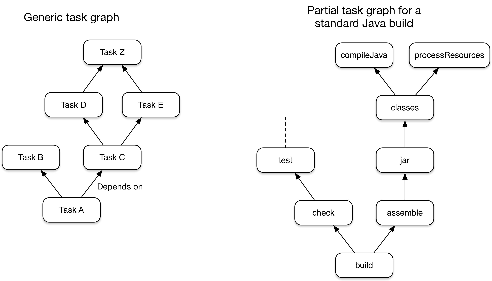

# Gradle

### 环境介绍

-   OpenJDK 17.0.5
-   Gradle 7.6
-   [示例代码 fly-gradle](https://github.com/zhangpanqin/fly-gradle)

## Gradle 项目下文件介绍

如果你的电脑安装了 gradle，可以使用 gradle init 去初始化一个新的 gradle 工程，然后使用电脑安装的 gradle 去执行构建命令。

但是每个开发电脑上的 gradle 版本不一样，为了统一构建环境，我们可以使用 gradle wrapper 限定项目依赖 gradle 的版本。


```shell
# 会生成 gradle/wrapper/* gradlew gradlew.bat
gradle wrapper --gradle-version 7.5.1 --distribution-type bin
```


```
.
├── build.gradle
├── gradle
│   └── wrapper
│       ├── gradle-wrapper.jar
│       └── gradle-wrapper.properties
├── gradle.properties
├── gradlew
├── gradlew.bat
├── settings.gradle
```

### gradlew 和 gradlew.bat

运行项目 `wrapper` 下定义的 gradle 去构建项目。

`gradlew` 是 macos 和 linux 系统下。

`gradlew.bat` 是 windows 系统下使用的。

### wrapper


wrapper 定义项目依赖那个版本的 gradle，如果本地 distributionPath 没有对应版本的 gradle，会自动下载对应版本的 gradle。

```properties
# gradle-wrapper.properties
distributionBase=GRADLE_USER_HOME
distributionPath=wrapper/dists
# 如果是国内项目，只需要修改这个url 就可以提高下载速度
distributionUrl=https\://services.gradle.org/distributions/gradle-6.7-bin.zip
zipStoreBase=GRADLE_USER_HOME
zipStorePath=wrapper/dists
```

`GRADLE_USER_HOME` 没有配置的话，默认是 `~/.gradle`

`zipStoreBase` 和 `zipStorePath` 定义了下载的 gradle (gradle-7.6-bin.zip) 存储的本地路径。

`distributionBase` 和 `distributionPath` 定义下载的 gradle 解压的本地目录。

`gradlew` 实际是运行 gradle-wrapper.jar 中的 [main 方法](https://github.com/gradle/gradle/blob/v7.6.1/subprojects/wrapper/src/main/java/org/gradle/wrapper/GradleWrapperMain.java#L38)，传递给 gradlew 的参数实际上也会传递给这个 main 方法。

gradle-wrapper.jar 会判断是否下载 wrapper 配置的 gradle，并且将传递参数给下载的 gradle，并运行下载的 gralde 进行构建项目。


升级 wrapper 定义的 gradle 版本

```shell
./gradlew wrapper --gradle-version 7.6
```


### settings.gradle

```groovy
pluginManagement {
    repositories {
        maven {
            url="file://${rootDir}/maven/plugin"
        }
        gradlePluginPortal()
    }
    plugins {
      	// spring_boot_version 可以在 gradle.properties 配置
        id 'org.springframework.boot' version "${spring_boot_version}"
    }
}
rootProject.name = 'fly-gradle'
include 'user-manage-service','user-manage-sdk'
include 'lib-a'
include 'lib-b'
```

settings.gradle 主要用于配置项目名称，和包含哪些子项目。

也可以用于配置插件的依赖版本（不会应用到项目中去，除非项目应用这个插件）和插件下载的


### build.gradle

build.gradle 是对某个项目的配置。配置 jar 依赖关系，定义或者引入 task 去完成项目构建。


### gradle.properties

主要用于配置构建过程中用到的变量值。也可以配置一些 gradle 内置变量的值，用于修改默认构建行为。

```properties
org.gradle.logging.level=quiet
org.gradle.caching=true
org.gradle.parallel=true
org.gradle.jvmargs=-Xms512m -Xmx2g -XX:MaxMetaspaceSize=512m -XX:+HeapDumpOnOutOfMemoryError -Dfile.encoding=UTF-8
```

 `org.gradle.jvmargs` 用来配置 Daemon 的 JVM 参数，默认值是 `-Xmx512m "-XX:MaxMetaspaceSize=384m"`。

当我们的项目比较大的时候，可能会由于 JVM 堆内存不足导致构建失败，就需要修改此配置。


`org.gradle.logging.level` 调整 gradle 的日志级别。参考 [gradle logging](https://docs.gradle.org/current/userguide/logging.html#sec:choosing_a_log_level) 选择想要的日志级别。


## Gradle Daemon

为加快项目构建，gralde 会启动一个常驻 JVM 后台进程去处理构建，Daemon 进程默认三小时过期且当内存压力大的时候也会关闭。

Gradle 默认会启用 Daemon 进程去构建项目。

```shell
# 查看 daemon 运行状态
./gradlew --status
# stop daemon 进程
./gradlew --stop
# 重启 daemon 进程
./gradlew --daemon
```


## 构建生命周期

Gradle 是基于 task 依赖关系来构建项目的，我们只需要定义 task 和 task 之间的依赖关系，Gradle 会保证 task 的执行顺序。

Gradle 在执行 task 之前会建立 `Task Graphs`，我们引入的插件和自己构建脚本会往这个 task graph 中添加 task。




Gradle 的构建过程分为三部分：初始化阶段、配置阶段和执行阶段。

### 初始化阶段

- 找到 settings.gradle，执行其中代码
- 确定有哪些项目需要构建，然后对每个项目创建 Project 对象，build.gradle 主要就是配置这个 Project 对象

```groovy
// settings.gradle
rootProject.name = 'basic'
println '在初始化阶段执行'
```


### 配置阶段

- 执行 build.gradle 中的配置代码，对 Project 进行配置
- 执行 Task 中的配置段语句
- 根据请求执行的 task，建立 task graph

```groovy
println '在配置阶段执行 Task 中的配置段语句'

tasks.register('configured') {
  println '在配置阶段执行 Task 中的配置段语句'
  doFirst {
    println '在执行阶段执行'
  }
  doLast {
    println '在执行阶段执行'
  }
}
```


### 执行阶段

根据 task graph 执行 task 代码。


## 依赖管理

### Maven 私服配置

我们一般都是多项目构建，因此只需要在父项目 build.gradle 配置 repositories。

```groovy
allprojects {
  repositories {
    maven {
      url "${mavenPublicUrl}"
      credentials {
        username "${mavenUsername}"
        password "${mavenPassword}"
      }
    }
    mavenLocal()
    mavenCentral()
  }
}
```

credentials 配置账号密码，当私服不需要权限下载的时候可以不配置。

Gradle 会按照配置的仓库顺序查询依赖下载。


### 配置依赖来自某个目录

```groovy
dependencies {
	compile files('lib/hacked-vendor-module.jar')
}
dependencies {
	compile fileTree('lib')
}
```

有的时候第三方库没有 maven 供我们使用，可以使用这个。


### 依赖冲突

#### 默认依赖冲突

::: tip
当出现依赖冲突的时候，gradle 优先选择版本较高的，因为较高版本会兼容低版本。
:::


```groovy
dependencies {
    implementation 'com.google.guava:guava:31.1-jre'
    implementation 'com.google.code.findbugs:jsr305:3.0.0'

    testImplementation 'org.junit.jupiter:junit-jupiter-api:5.8.1'
    testRuntimeOnly 'org.junit.jupiter:junit-jupiter-engine:5.8.1'
}
```


我们可以执行下面命令查看项目依赖的版本：

```sh
./gradlew dependency-management:dependencies --configuration compileClasspath

------------------------------------------------------------
Project ':dependency-management'
------------------------------------------------------------

compileClasspath - Compile classpath for source set 'main'.
+--- org.springframework.boot:spring-boot-dependencies:3.0.2
+--- com.google.guava:guava:31.1-jre
|    +--- com.google.guava:failureaccess:1.0.1
|    +--- com.google.guava:listenablefuture:9999.0-empty-to-avoid-conflict-with-guava
|    +--- com.google.code.findbugs:jsr305:3.0.2
|    +--- org.checkerframework:checker-qual:3.12.0
|    +--- com.google.errorprone:error_prone_annotations:2.11.0
|    \--- com.google.j2objc:j2objc-annotations:1.3
\--- com.google.code.findbugs:jsr305:3.0.0 -> 3.0.2
```

我们可以看到，gradle 选择了 com.google.code.findbugs:jsr305:3.0.2 这个版本。


#### 强制使用某个版本

如果我们想使用 com.google.code.findbugs:jsr305:3.0.0 版本

```groovy
dependencies {
    implementation 'com.google.guava:guava:31.1-jre'
    implementation 'com.google.code.findbugs:jsr305:3.0.0', {
        force = true
    }
    testImplementation 'org.junit.jupiter:junit-jupiter-api:5.8.1'
    testRuntimeOnly 'org.junit.jupiter:junit-jupiter-engine:5.8.1'
}
```


```shell
./gradlew -q dependency-management:dependencyInsight --dependency jsr305 --configuration compileClasspath
```

```text
com.google.code.findbugs:jsr305:3.0.0 (forced)
  Variant compile:
    | Attribute Name                 | Provided | Requested    |
    |--------------------------------|----------|--------------|
    | org.gradle.status              | release  |              |
    | org.gradle.category            | library  | library      |
    | org.gradle.libraryelements     | jar      | classes      |
    | org.gradle.usage               | java-api | java-api     |
    | org.gradle.dependency.bundling |          | external     |
    | org.gradle.jvm.environment     |          | standard-jvm |
    | org.gradle.jvm.version         |          | 17           |

com.google.code.findbugs:jsr305:3.0.0
\--- compileClasspath

com.google.code.findbugs:jsr305:3.0.2 -> 3.0.0
\--- com.google.guava:guava:31.1-jre
     \--- compileClasspath
```

#### 禁用依赖传递

guava 不会传递依赖它依赖的库到当前库，可以看到

```groovy
dependencies { 
    implementation 'com.google.guava:guava:31.1-jre', {
        transitive = false
    }
    implementation 'com.google.code.findbugs:jsr305:3.0.0'
}
```

```shell
./gradlew dependency-management:dependencies --configuration compileClasspath

------------------------------------------------------------
Project ':dependency-management'
------------------------------------------------------------

compileClasspath - Compile classpath for source set 'main'.
+--- org.springframework.boot:spring-boot-dependencies:3.0.2
+--- com.google.guava:guava:31.1-jre
\--- com.google.code.findbugs:jsr305:3.0.0
```

可以看到 guava 依赖的 jar 没有传递到当前项目中来。


#### 排除某个依赖

Guava 依赖的别的 jar 可以传递进来，而且排除了 `findbugs`, 项目依赖的版本为 `3.0.0`。

```groovy
dependencies { 
	 implementation 'com.google.guava:guava:31.1-jre', {
        exclude group: 'com.google.code.findbugs', module: 'jsr305'
    }
    implementation 'com.google.code.findbugs:jsr305:3.0.0'
}
```


```shell
./gradlew dependency-management:dependencies --configuration compileClasspath

------------------------------------------------------------
Project ':dependency-management'
------------------------------------------------------------

compileClasspath - Compile classpath for source set 'main'.
+--- org.springframework.boot:spring-boot-dependencies:3.0.2
+--- com.google.guava:guava:31.1-jre
|    +--- com.google.guava:failureaccess:1.0.1
|    +--- com.google.guava:listenablefuture:9999.0-empty-to-avoid-conflict-with-guava
|    +--- org.checkerframework:checker-qual:3.12.0
|    +--- com.google.errorprone:error_prone_annotations:2.11.0
|    \--- com.google.j2objc:j2objc-annotations:1.3
\--- com.google.code.findbugs:jsr305:3.0.0
```

可以看到 guava 传递到当前项目的依赖少了 `findbugs` 。


### 配置依赖之间继承

```txt
configurations {
    integrationTestImplementation.extendsFrom testImplementation
    integrationTestRuntimeOnly.extendsFrom testRuntimeOnly
}

configurations.all {
    resolutionStrategy {
        force 'org.apache.tomcat.embed:tomcat-embed-core:9.0.43'
    }
    exclude group: 'org.slf4j', module: 'slf4j-simple'
}
```


### api 和 implementation 区别

jar b 包含一下依赖

```groovy
dependencies {
    api 'org.apache.commons:commons-lang3:3.12.0'
    implementation 'com.google.guava:guava:31.1-jre'
}
```

项目 a 引入 jar b ，commons-lang3 和 guava 都可以被工程 a 使用，只是二者 scope 不一样。

api 对应 compile，在 `工程 a` 可以直接使用，编译可以通过。

implementation 对应 runtime，编译找不到 guava 中的类。


## Task

我们引用的插件实际是添加 task 到 task graph 中去。


我们知道 build.gradle 实际是用来配置对应项目的 org.gradle.api.Project。

因此我们可以在 build.gradle 中引用 org.gradle.api.Project 暴露的属性。

我们可以在 [gradle dsl](https://docs.gradle.org/7.6/dsl/org.gradle.api.Project.html#N14F33) 和 Project 接口中可以知道可以访问哪些属性。

tasks 实际就是 Project 暴露的一个属性，因此我们可以使用 tasks 往当前项目中注册 task。

```groovy
tasks.register('hello') {
    doLast {
        println 'hello'
    }
}
```

推荐使用 tasks.register 去注册 task，而不是 tasks.create 去直接创建。

tasks.register 注册的 task 只会在用到的时候才会初始化。

### Groovy 闭包

[Groovy Closures](https://groovy-lang.org/closures.html#_syntax)

```groovy
{ [closureParameters -> ] statements }
```


闭包的示例

```groovy
{ item++ }                                          

{ -> item++ }                                       

{ println it }                                      

{ it -> println it }                                
```

:::tip

当方法的最后一个参数是闭包时，可以将闭包放在方法调用之后。

:::

比如注册一个 task 的接口是 

```groovy
register(String var1, Action<? super Task> var2)

tasks.register("task55"){
    doFirst {
        println "task55"
    }
}

tasks.register("task66",{
    doFirst {
        println "task66"
    }
})
```


#### Task Type

gradle 已经定义好一些 task type，我们可以使用这些 task type 帮助我们完成特定的事情。比如我们想要执行某个 shell 命令。

[Exec - Gradle DSL Version 7.6](https://docs.gradle.org/7.6/dsl/org.gradle.api.tasks.Exec.html)

```groovy
tasks.register("task3", Exec) {
    workingDir "$rootDir"
    commandLine "ls"
}
```


## Plugin

### 插件分类

Gradle 有两种类型的插件 `binary plugins` and `script plugins`

二进制插件就是封装好的构建逻辑打成 jar 发布到线上，供别的项目使用。

脚本插件就是一个 `*.gradle` 文件。


### buildSrc

一般我们的项目是多项目构建，各个子项目会共享一些配置，比如 java 版本，repository 还有 jar publish 到哪里等等。

我们可以将这些统一配置分组抽象为单独的插件，子项目引用这个插件即可。便于维护，不用在各个子项目都重复配置相同的东西。

buildSrc 这个目录必须在根目录下，它会被 gradle 自动识别为一个 [composite build](https://docs.gradle.org/current/userguide/composite_builds.html#defining_composite_builds)，并将其编译之后放到项目构建脚本的 classpath 下。

buildSrc 也可以写插件，我们可以直接在子项目中使用插件 id 引入。

```
buildSrc/
├── build.gradle
├── settings.gradle
└── src
    ├── main
    │   ├── groovy
    │   │   └── mflyyou.hello2.gradle
    │   ├── java
    │   │   └── com
    │   │       └── mflyyou
    │   │           └── plugin
    │   │               ├── BinaryRepositoryExtension.java
    │   │               ├── BinaryRepositoryVersionPlugin.java
    │   │               └── LatestArtifactVersion.java
```

buildSrc/build.gradle

`groovy-gradle-plugin` 对应的是使用 groovy 写插件。

`java-gradle-plugin` 对应 java

```groovy
plugins {
    id 'groovy-gradle-plugin'
    id 'java-gradle-plugin'
}
gradlePlugin {
    plugins {
        helloPlugin {
            id = 'com.mflyyou.hello'
            implementationClass = 'com.mflyyou.plugin.BinaryRepositoryVersionPlugin'
        }
    }
}
```

我们就可以在子项目使用插件

```groovy
plugins {
    id 'com.mflyyou.hello'
    id 'mflyyou.hello2'
}
```


### 插件使用

- Applying plugins with the plugins DSL

```groovy
plugins {
    id 'java'
}
```


- Applying a plugin with the buildscript block

```groovy
buildscript {
    repositories {
        gradlePluginPortal()
    }
    dependencies {
        classpath 'com.jfrog.bintray.gradle:gradle-bintray-plugin:1.8.5'
    }
}

apply plugin: 'com.jfrog.bintray'
```

- Applying a script plugin

```shell
apply from: 'other.gradle'
```

