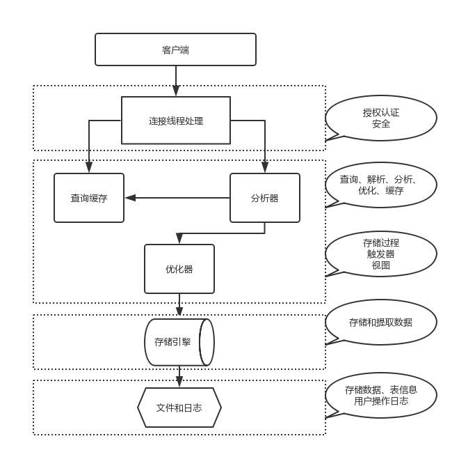
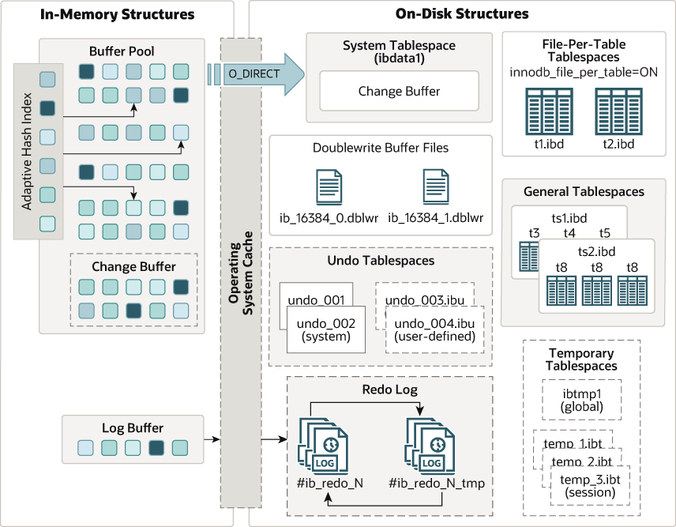
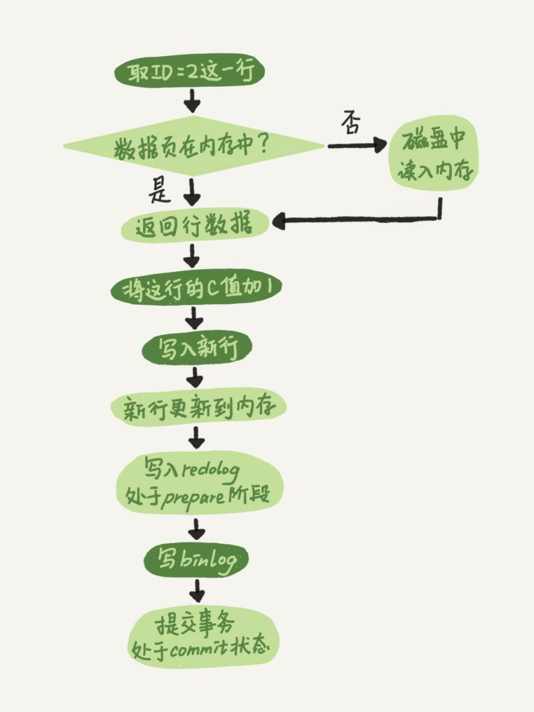
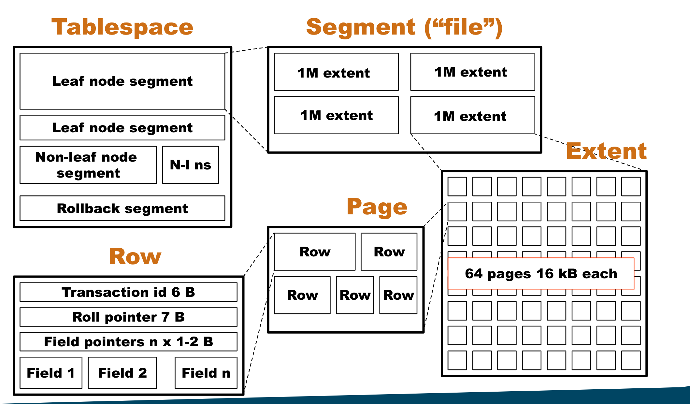
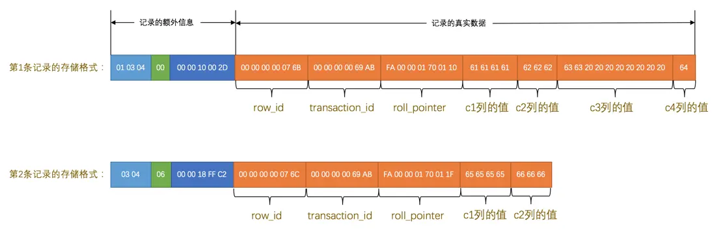

# Mysql 架构

## Mysql 架构说明


上图为 Mysql 8.0 官网架构图。Mysql 是一个 C/S 架构的程序。

Mysql 的 Server 端内部又又可以分为 `server` 和 `存储引擎` 两部分。我们查询数据，一般是 server 层和存储引擎打交道，然后存储引擎再给我们数据文件系统打交道，从里面找出我们需要的数据。

### Mysql 工作流程



1. 当一个客户端向服务端发送连接请求后，MySQL Server 会从线程池中分配一个线程来和客户端进行连接，以后该客户端的请求都会被分配到该线程上。如果这个链接（jdbc 连接）空闲 8 个小时，Mysql 会断掉这个链接。`wait_timeout` 控制。
2. 当我们执行查询语句时，如果命中缓存直接返回查询数据。如果没有命中缓存，SQL 解析，SQL 优化生成执行计划，然后 server 层调用存储引擎层进行数据查询，其中 server 层和存储引擎层可能会多次打交道把数据查询出来。
3. 存储引擎查询索引或者表数据文件，得到数据返回给 server 层，然后 server 层返回给 client。

Mysql 将数据储存在硬盘上，为了提高查询速度，比较好的做法是将索引数据和一部分热数据（经常访问的数据）放到内存中（Mysql 的 **Buffer Poll**）。

当检索数据的时候，Mysql 通过索引查找，就可以知道数据在磁盘哪块了，从硬盘对应位置读取对应的数据到内存中返回给 server 层。

## Mysql 存储文件介绍

### 查看 Mysql 数据文件的目录

```sql
show variables like '%datadir%';
```

linux 下一般存储位置就是 `/var/lib/mysql/` 。

### 系统表空间

系统表空间是所有表共享的，它保存了数据表结构，事务信息 等

```sql
SHOW VARIABLES LIKE 'innodb_data_file_path%'
-- ibdata1:12M:autoextend
```

### 独立表空间

**Mysql 8.0 是默认开启独立表空间的**，默认每张表使用一个文件进行保存数据和索引

```sql
-- 查看是否开启独立表空间配置
mysql> show variables like '%innodb_file_per_table%';
+-----------------------+-------+
| Variable_name         | Value |
+-----------------------+-------+
| innodb_file_per_table | ON    |
+-----------------------+-------+
```

::: tip

独立表空间是指每张表单独用一个文件储存每张表对应的表结构、数据和索引，文件扩展名为 ibd。

每个数据库会有一个对应目录用于保存当前数据库中的数据文件

:::

比如我有一个 sandbox 数据库，这个库里创建了两个表 order 和 user。

那么 `/var/lib/mysql/sandbox` 存储的就是这个 sandbox 数据库的数据。

```txt
ls -l /var/lib/mysql/sandbox/
-rw-r----- 1 mysql mysql 131072 Mar 23 15:27 order.ibd
-rw-r----- 1 mysql mysql 163840 Mar 23 15:12 user.ibd
```

::: tip

当我们在某个数据库中创建一张表时，除了在系统表空间生成元数据和表结构，也会在对应的数据库目录下，新建一个 tablename.ibd 文件。

:::

## InnoDB 存储引擎架构



### Buffer Pool

`Buffer Poll` 是主存中的一个区域，缓存 InnoDB 访问过的表和索引数据。在专用服务器上，高达 80% 的物理内存通常分配给缓冲池。

::: tip

Buffer Pool 是一片连续的内存空间，然后按照默认的 `16KB` 的大小划分出一个个的页， Buffer Pool 中的页就叫做缓存页。

当查询数据时，InnoDB 是会把整个页的数据加载到 Buffer Pool 中。因为，通过索引只能定位到磁盘中的页，而不能定位到页中的一条记录。将页加载到 Buffer Pool 后，再通过页里的页目录去定位到某条具体的记录。

:::

LRU（Least recently used）算法保证了频繁访问的数据一直留在 Buffer Pool 中，而一些很少访问的数据在某些时机淘汰掉，从而保证 Buffer Pool 不会因为满了而导致无法再缓存新的数据，同时还能保证常用数据留在 Buffer Pool 中。

当我们要修改的数据在 `Buffer Poll` 中，直接修改缓存页，在落盘就行了。

但是有的时候，我们修改的页不在 `Buffer Poll` 中，如果没有 change buffer，InnoDB 会将数据所在页加载到`Buffer Poll` ，修改，再落盘。为了提高效率，引入了 change buffer，想将修改操作写入 redo log 中，而不必加载数据。当再次读取到这页数据时，将 change buffer 中的页和数据页合并，达到数据一致性效果。

**Change Buffer** 它应用在\*\*非唯一普通索引页（non-unique secondary index page）。

### binlog

binlog 是 server 层的，不管那个存储引擎都会有 binlog。Mysql 主从复制和备份都是依靠 binlog。

`binlog` 日志有三种格式，可以通过 `binlog_format` 参数指定。

-   **statement**，会记录所有执行成功 DDL 和 DML（不包括 select 语句）操作，包括`UPDATE和DELETE`操作影响行数为 0 的情况。
-   **row**，会记录所有执行成功 DDL 和 DML（不包括 select 语句）操作，`UPDATE和DELETE`操作影响行数为 0 的不会记录。
-   **mixed**，用 **row** 时符合 **row** 规则，用 **statement** 符合 **statement** 规则

binlog_format 指定 `statement`，记录的内容是`SQL`语句原文，比如执行一条 `update a set update_time=now() where id=1`，记录的内容如下。但是 now() 会导致数据不一样。

为了解决这个问题，有 row，记录的是数据的修改值。

如果一个 SQL，修改了全表数据，row 模式会非常大，同步的时候消耗更多的 io 资源，延迟也高。

为了解决这个问题，引入了 mixed ，MySQL 会判断这条 SQL 语句是否可能引起数据不一致，如果是，就用 row 格式，否则就用 statement 格式。

### redo log

::: tip

redo log 保证了数据的持久性。属于 InnoDB。

:::

`InnoDB ` 存储引擎是以页为单位来管理存储空间。当 InnoDB 读取磁盘上的页数据到 Buffer Pool 中，修改了数据，将 Buffer Pool 中对应的页落盘。如果一条 SQL 修改的大量数据分布零散，当这些页都写入到磁盘时，随机 io 性能太拉。

我们只是想持久化数据的修改，即使后来系统崩溃，在重启后也能把这种修改恢复过来。redo log 就是做这个的，提交事务的时候，它将我们修改的字段数据顺序写入到日志文件中，而不必将脏页持久化。

写 redo log 的时候，实际先顺序写入到 Buffer Pool 中的 Log Buffer，当我们提交事务或者 Log Buffer 空间不足时，在讲 Log Buffer 落盘，页持久化了 redo log。

### 两阶段提交

`redo log` 让 InnoDB 存储引擎拥有了崩溃恢复能力，保证数据的持久性

`binlog` 保证了 MySQL 集群架构的数据一致性。

如果这两个日志逻辑不一样，会导致数据丢失或者没通过成功。

为了解决两份日志之间的逻辑一致问题，`InnoDB `存储引擎使用**两阶段提交**方案。

原理很简单，将 `redo log` 的写入拆成了两个步骤`prepare`和`commit`，这就是**两阶段提交**。



第一阶段提交，redo log 处于 prepare 状态落盘，然后 server 层写入 binlog （cache）。

第二阶段提交，binlog 落盘，redo log 处于 commit 状态落盘。

下面我们分析一下，两阶段提交的好处

情景一，redo log 处于 prepare 状态时，如果写 bin log 失败了，那么更新失败，此时 redo log 没有 commit，bin log 也没有记录，两者的状态是一致的，没有问题。

情景二，redo log 处于 prepare 状态时，写 bin log 成功，但是宕机导致 commit 失败了。此时 bin log 产生了记录，redo log 没有写入成功，数据暂时不一致。

当 MySQL 重启时，会检查 redo log 中处于 prepare 状态的记录。在 redo log 中，记录了一个叫做 XID 的字段，这个字段在 bin log 中也有记录，MySQL 会通过这个 XID，如果在 bin log 中找到了，那么就 commit 这个 redo log，如果没有找到，说明 bin log 其实没有写成功，就放弃提交。

### 分布式事务

分布式事务是指一个全局事务中，有多个 mysql 参与的小事务组成一个大事务。

XA 规范提出 2 个角色：

-   一个全局事务由多个小的事务组成，所以我们得在某个地方找一个总揽全局的家伙，这个家伙用于和各个小事务进行沟通，指导它们是提交还是回滚。这个家伙被称作事务协调器（Transaction Coordinator）
-   管理一个小事务的家伙被称作事务管理器（Transaction Manager）。

此时 XA 规范中指出，要提交一个全局事务，必须分为 2 步：

-   Prepare 阶段：**事务协调器**通知**事务管理器** redo log 落盘。
-   Commit 阶段：第一阶段都 ok，然后**事务协调器**通知**事务管理器**提交事务。

#### MySQL 中的 XA 事务

-   `XA {START|BEGIN} xid`：该语句用于开启一个 XA 事务，此时该 XA 事务处于 `ACTIVE` 状态。
-   `XA END xid`：在使用`XA START xid`开启了一个 XA 事务后，客户端就可以接着发送属于这个 XA 事务的各条语句，等所有语句都发送完毕后，就可以接着发送`XA END xid`来告知服务器由`xid`标识的 XA 事务的所有语句都输入完了。此时该 XA 事务处于`IDLE`状态。
-   `XA PREPARE xid`：对于处于`IDLE`状态的 XA 事务，应用程序就可以询问 MySQL 服务器是否准备好提交这个 XA 事务了，此时就可以给服务器发送`XA PREPARE xid`语句。当 MySQL 服务器收到此语句后，就需要做准备提交前的工作了，比如把该事务执行过程中所产生的 redo 日志刷新到磁盘等。此时 XA 事务处于`PREPARE`状态。
-   `XA COMMIT xid [ONE PHASE]`：对于处于`PREPARE`状态的 XA 事务，应用程序可以发送`XA COMMIT xid`来让 MySQL 服务器提交 XA 事务。如果此 XA 事务尚处于`IDEL`状态，那应用程序可以不发送`XA PREPARE xid`，而直接发送`XA COMMIT xid ONE PHASE`来让 MySQL 服务器直接提交事务即可。此 XA 事务处于`COMMITE`状态。
-   `XA ROLLBACK xid`：应用程序通过发送此语句来让 MySQL 服务器回滚 xid 所标识的事务。此时 XA 事务处于`ABORT`状态。
-   `XA RECOVER`：应用程序想看一下当前 MySQL 服务器上已经处于 Prepare 状态的 XA 事务有哪些，就可以发送该语句。

### undo log

::: tip

undo log 保证了数据的原子性。属于 InnoDB。

:::

undo log 是一种用于撤销回退的日志。在事务没提交之前，MySQL 会先记录更新前的数据到 undo log 日志文件里面，当事务回滚时，可以利用 undo log 来进行回滚。

-   在**插入**一条记录时，要把这条记录的主键值记下来，这样之后回滚时只需要把这个主键值对应的记录**删掉**就好了；
-   在**删除**一条记录时，要把这条记录中的内容都记下来，这样之后回滚时再把由这些内容组成的记录**插入**到表中就好了；
-   在**更新**一条记录时，要把被更新的列的旧值记下来，这样之后回滚时再把这些列**更新为旧值**就好了。

#### Undo Log 的作用

1. Undo Log 用来记录每次修改之前的历史值，配合 Redo Log 用于故障恢复。
2. 事务回滚
3. MVCC（Multi-Versioin Concurrency Control）

### MVCC

事务 id 是由 Mysql 控制唯一且递增。

对于 `读提交` 和 `可重复读` 隔离级别的事务来说，快照读是通过 Read View + undo log 来实现的，它们的区别在于创建 Read View 的时机不同：

-   「读提交」隔离级别是在每个 select 都会生成一个新的 Read View，也意味着，事务期间的多次读取同一条数据，前后两次读的数据可能会出现不一致，因为可能这期间另外一个事务修改了该记录，并提交了事务。
-   「可重复读」隔离级别是启动事务时生成一个 Read View，然后整个事务期间都在用这个 Read View，这样就保证了在事务期间读到的数据都是事务启动前的记录。

这个 `ReadView` 中主要包含 4 个比较重要的内容：

-   `m_ids`：表示在生成`ReadView`时当前系统中活跃的读写事务的`事务id`列表。
-   `min_trx_id`：表示在生成`ReadView`时当前系统中活跃的读写事务中最小的`事务id`，也就是`m_ids`中的最小值。
-   `max_trx_id`：表示生成`ReadView`时系统中应该分配给下一个事务的`id`值。
-   `creator_trx_id`：表示生成该`ReadView`的事务的`事务id`。

有了这个`ReadView`，这样在访问某条记录时，只需要按照下边的步骤判断记录的某个版本是否可见：

-   如果被访问版本的`trx_id`属性值与`ReadView`中的`creator_trx_id`值相同，意味着当前事务在访问它自己修改过的记录，所以该版本可以被当前事务访问。
-   如果被访问版本的`trx_id`属性值小于`ReadView`中的`min_trx_id`值，表明生成该版本的事务在当前事务生成`ReadView`前已经提交，所以该版本可以被当前事务访问。
-   如果被访问版本的`trx_id`属性值大于或等于`ReadView`中的`max_trx_id`值，表明生成该版本的事务在当前事务生成`ReadView`后才开启，所以该版本不可以被当前事务访问。
-   如果被访问版本的`trx_id`属性值在`ReadView`的`min_trx_id`和`max_trx_id`之间，那就需要判断一下`trx_id`属性值是不是在`m_ids`列表中，如果在，说明创建`ReadView`时生成该版本的事务还是活跃的，该版本不可以被访问；如果不在，说明创建`ReadView`时生成该版本的事务已经被提交，该版本可以被访问。

如果某个版本的数据对当前事务不可见的话，那就顺着版本链找到下一个版本的数据，继续按照上边的步骤判断可见性，依此类推，直到版本链中的最后一个版本。如果最后一个版本也不可见的话，那么就意味着该条记录对该事务完全不可见，查询结果就不包含该记录。

### 数据存储介绍



### 表空间

在 `InnoDB` 存储引擎下，表相关的所有数据（比如业务数据和索引数据）都储存在**表空间（tablespace）**中。每张表都有一个自己的文件（.ibd）去储存相关数据（开启独立表空间设置）。

表空间又可以细分为 `segment`，`extent`，`page`，`row`。

### 段

表空间又包含多个段（segment），常见的数据段有：

-   `Leaf node segment` 数据段，存储当前表中的数据
-   `Non-Leaf node segment` 索引段，存储当前表中的索引

### 区

段包含很多个区，每个区始终为 1MB 。区由多个连续连续的页组成，页的大小通常是 16KB，所以一个区可以有 64 （1024/16=64）个连续页。

### 页

**页是 `InnoDB` 与磁盘交互的最小单位**。从磁盘上读取数据，一次性是读取一页数据。将内存中的数据落盘到硬盘上，也是操作一页数据。

比如我们修改了 `id=3` 某行数据，数据持久化的时候，是需要将这行所在的页全部落盘在硬盘上。

```sql
update test_table set a=2 where id =3;
```

页也有类型，数据页，索引页等等。

```sql
-- 查看页的大小，默认是 16KB =16*1024bit
mysql> show variables like '%innodb_page_size%';
+------------------+-------+
| Variable_name    | Value |
+------------------+-------+
| innodb_page_size | 16384 |
+------------------+-------+
```

### 行

每页存放一行一行的数据。

```sql
mysql> SHOW TABLE STATUS LIKE "test_data_type"\G;
*************************** 1. row ***************************
           Name: test_data_type
         Engine: InnoDB
        Version: 10
     Row_format: Dynamic
           Rows: 22
 Avg_row_length: 14894
    Data_length: 327680
Max_data_length: 0
   Index_length: 0
      Data_free: 0
 Auto_increment: 243
    Create_time: 2020-09-21 01:55:51
    Update_time: 2020-09-21 02:06:59
     Check_time: NULL
      Collation: utf8mb4_0900_ai_ci
       Checksum: NULL
 Create_options:
        Comment:
```

`Row_format` 定义了一行数据在数据页中怎么保存。



一个页一般是 `16KB`，当记录中的某个字段类型数据太大，当前页放不下的时候，会把多余的数据存储到其他页中，这种现象称为`行溢出`。

然后会在当前行数据中保存行溢出数据所在的页。

行数据中，除了我们表结构中自己定义的字段，还有 Mysql 添加的元数据字段。比如 `row_id`（当没有主键数据的时候添加），`transaction_id`（主要用于 MVCC）和 `roll_pointer` 。
