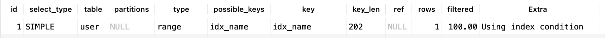

## Explain 查看执行计划

## 定位慢 sql

1、druid 连接池也是可以打印慢 sql。一般执行时间长于 1s 的都要优化。

```yaml
spring:
  datasource:
  	druid:
  	 filter:
  	 	stat:
          enabled: true
          # 执行时间小于 1 秒记录为慢 sql
          slow-sql-millis: 1000
          log-slow-sql: true
          db-type: mysql
          merge-sql: true
```

logback 配置

```xml
<!-- druid sql 日志追踪器   -->
<appender name="druidSqlRollingFile" class="ch.qos.logback.core.rolling.RollingFileAppender">
    <file>${logPath:-${defaultLogPath}}/druid/druid-sql.log</file>
    <rollingPolicy class="ch.qos.logback.core.rolling.SizeAndTimeBasedRollingPolicy">
        <fileNamePattern>${logPath:-${defaultLogPath}}/druid/druid-sql.%d{yyyy-MM-dd}.%i.log
        </fileNamePattern>
        <maxFileSize>${LOG_FILE_MAX_SIZE:-10MB}</maxFileSize>
        <maxHistory>${LOG_FILE_MAX_HISTORY:-20}</maxHistory>
    </rollingPolicy>
    <encoder>
        <pattern>${FILE_LOG_PATTERN}</pattern>
        <charset>UTF-8</charset>
    </encoder>
</appender>
<logger name="druid.sql.Statement" level="warn" additivity="false">
    <appender-ref ref="CONSOLE"/>
    <appender-ref ref="druidSqlRollingFile"/>
</logger>
```

2、mysql 的慢 sql 日志，从这个慢 sql 日志文件中分析出执行慢的 sql

默认是不开启慢 sql 日志记录的

```sql
-- 查看开启慢 sql
show variables like 'slow_query_log%';
-- 查看执行时间大于多少为慢 sql
show variables like 'long_query_time%';
```


开启慢 sql 日志记录，这是动态修改，没有持久化，数据库重启就失效了。

```sql
-- 这个值单位是秒，不要设置的太小。不然打印日志太多，我们要先优化哪些执行时间较长的 sql 比如大于 5 秒，大于 10 秒
-- 一步一步优化
set global long_query_time=3;
-- 开启慢 sql 记录
set global slow_query_log=1;
```

我们可以使用 select sleep(5); 来产生慢 sql 。

```sql
# Time: 2021-03-07T07:24:10.757715Z
# User@Host: root[root] @ localhost []  Id:    17
# Query_time: 5.070525  Lock_time: 0.000000 Rows_sent: 1  Rows_examined: 0
SET timestamp=1615101845;
select sleep(5);
```

也可以在 mysql 配置文件中修改,这样数据库重启也是开启的。

```txt
[mysqld]
slow_query_log=1
slow_query_log_file=/var/lib/mysql/slow-log.log
long_query_time=3
```

按 -s 指定按查询时间排序，-t 指定返回多少条记录数，也可以 -g 筛选，类似于 grep 操作。

```shell
mysqldumpslow -s t -t 10  /usr/local/var/mysql/wanguyunxiao-slow.log | more
mysqldumpslow -s t -t 10 -g "left join"  /usr/local/var/mysql/wanguyunxiao-slow.log | more
```

### 慢 sql 产生的原因

1、可能没有用到索引，建立合适的索引

2、有的时候索引也建立了，但是你联合查询，关联 n 多个表查询速度可能慢。阿里规范推荐最多关联 3 个表，这个时候我们就需要简化 sql 了，用多个 sql 完成你的业务逻辑，而不是一条 sql 查询出你需要的数据。

3、sql 一定要写规范，索引的使用要符合最左匹配原则，这和索引的数据结构有关

4、隐式数据类型转换，条件做函数计算等等，这些都要避免

5、还有一种比较特殊，有索引，但是没有做索引，这个时候可以强制走索引，你也要去优化你的索引统计数据。或者优化你的表空间文件了

```sql
-- 实际就是更新索引的统计数据，让索引更有效利用，一般在空闲的时候做。
ANALYZE TABLE table_name;
```

6、表空间文件优化。当我们真删除数据过多，但是数据库的表空间文件可能并没有缩小，这时候我们需要在业务不忙的时候去优化表空间文件。

```sql
-- 会锁表，优化了表空间文件及索引相关的数据。定期执行命令即可。
OPTIMIZE TABLE tbl_name [, tbl_name] ...
```


## Explain 查看执行计划

### 数据准备

```sql

CREATE TABLE `order` (
  `id` bigint NOT NULL AUTO_INCREMENT,
  `user_id` bigint DEFAULT NULL,
  `product_name` varchar(50) NOT NULL DEFAULT '',
  `productor` varchar(30) DEFAULT NULL,
  `ext` varchar(30) DEFAULT NULL,
  PRIMARY KEY (`id`),
  KEY `idx_user_id_product_name_productor` (`user_id`,`product_name`,`productor`)
) ENGINE=InnoDB AUTO_INCREMENT=10 DEFAULT CHARSET=utf8mb4 COLLATE=utf8mb4_0900_ai_ci;

CREATE TABLE `user` (
  `id` bigint NOT NULL AUTO_INCREMENT,
  `name` varchar(50) NOT NULL DEFAULT '',
  `age` int DEFAULT NULL,
  `occupation` varchar(50) NOT NULL DEFAULT '',
  `phone_num` varchar(50) NOT NULL DEFAULT '',
  PRIMARY KEY (`id`),
  UNIQUE KEY `ux_phone_num` (`phone_num`) USING BTREE,
  KEY `idx_name` (`name`) USING BTREE
) ENGINE=InnoDB AUTO_INCREMENT=11 DEFAULT CHARSET=utf8mb4 COLLATE=utf8mb4_0900_ai_ci;

INSERT INTO `order` (`id`, `user_id`, `product_name`, `productor`, `ext`) VALUES
(1, 1, 'p1', 'WHH', '111'),(2, 1, 'p2', 'WL', '222'),(3, 1, 'p1', 'DX', '1213'),
(4, 2, 'p1', 'WHH', '14124'),(5, 2, 'p5', 'WL', '124'),(6, 3, 'p3', 'MA', '12412'),
(7, 4, 'p1', 'WHH', '1241'),(8, 6, 'p1', 'WHH', '124124'),(9, 9, 'p8', 'TE', '124124');

INSERT INTO `user` (`id`, `name`, `age`, `occupation`, `phone_num`) VALUES
(1, 'i', 14, 'it', '101'),(2, 'a', 21, 'it', '102'),(3, 'b', 23, 'it', '103'),
(4, 'c', 50, 'a', '104'),(5, 'd', 15, 'a', '105'),(6, 'e', 20, 'a', '106'),(7, 'f', 21, 'b', '107'),
(8, 'g', 23, 'b', '108'),(9, 'h', 50, 'b', '109'),(10, 'i', 15, 'c', '111');
```


```sql
EXPLAIN SELECT u1.`name`,tmp1.occupation FROM (SELECT
	u.occupation
FROM
	`user` AS u
GROUP BY
	u.occupation
HAVING
	AVG(u.age) > 20) as tmp1 INNER JOIN `user` as u1 on u1.occupation=tmp1.occupation

```


### id

`select`  执行的顺序标识，序号越大越先执行，相同序号，自上而下执行


### table

不论我们的查询语句有多复杂，里边儿包含了多少个表，到最后也是单表访问的每个表的。

table 标识对那个表的查询。

`derivedN` : N 是某个 id 值，表示对某个查询（id 知道值是哪个查询派生的）派生的表。 


#### partitions

当前查询所用的分区，一般分区表会使用。没有分区时，这个值是 `NULL`


### type，重要关注

表明当前表是怎么 join 的，可以判断 sql 性能。

::: tips

主要关注这个顺序，index，ALL 都需要优化。

system > const > eq_ref > ref > range > index > ALL

:::

#### ALL

ALL 标识全表扫描，我们要避免全表扫描。

```sql
EXPLAIN SELECT id, user_id, ext FROM `order`;
```


::: tips

只是多了一个 ext 字段，就不一样了，因为索引树拿不到想要的全部数据。

:::


#### index

使用了索引，但是把整个索引树扫了一遍就可以得到想要的数据，也可以理解为扫描了覆盖索引，覆盖索引包含我们需要的全部数据。

```sql
EXPLAIN SELECT id, user_id FROM `order`;
```


::: tips

对于 `InnoDB` 存储引擎的表来说，二级索引的 B+ 树只包含索引列和主键列的值。

:::


#### range

使用索引进行范围查询。一般是 =, <>, >, >=, <, <=, IS NULL, <=>, BETWEEN, IN() 操作中

```sql
EXPLAIN SELECT * FROM `order` WHERE user_id >1;
```


#### ref

查询的时候，条件是普通索引等值查询

```sql
EXPLAIN SELECT * FROM `order` WHERE user_id=1;
```


#### eq_ref

对该表的查询，使用的是主键或者唯一索引等值判断

```sql
EXPLAIN SELECT u1.* FROM `user` AS u1 INNER JOIN`user` AS u2 ON u1.phone_num=u2.phone_num WHERE u1.id>4;
```


### const

使用主键或唯一索引等值查询。

```sql
EXPLAIN SELECT * FROM `user` WHERE id=1;
```


### system

表只有一行数据，一般是系统表。


### possible_keys

当前查询中可能用到的索引，但是实际查询中可能不用这个索引。查询优化器计算使用不同索引的成本后，可以选择使用别的索引。

::: tips

possible_keys 中值并不是越多越好，可能使用的索引越多，查询优化器计算查询成本时就得花费更长时间。

如果可以的话，尽量删除那些用不到的索引。

:::


### key

当前查询用到的真实索引。当可能走索引查询时，但实际没有用到索引查询，你可能需要去分析表，更新索引统计数据，让索引更有效利用。

```sql
-- 实际就是更新索引的统计数据，让索引更有效利用，一般在空闲的时候做。
ANALYZE TABLE table_name;
```


#### key_len

使用某个索引执行查询时，该索引记录的最大长度。


### ref

当前查询是索引列等值查询时，type 是等值查询的类型，ref 就是与这个等值查询关联的字段。


#### rows，需要关注

rows列表示MySQL认为执行查询必须检查的行数。

对于 InnoDB 表，这个数字是一个估计值，可能并不总是准确的。

::: tips

全表扫描只是扫描的全表行数，使用索引扫描是预计索引行数。索引数据很少，扫描比较快。

:::


#### filtered，需要关注

filtered 和 rows 一起使用，表明下一个 id 查询时，需要 rows x filtered 行数据去 join 下一个查询。


#### extra，需要关注

extra 包含 Using filesort 和 Using temporary 考虑优化。

- Using where

当某个搜索条件需要在 `server层` 进行判断时，在 `Extra` 列中会提示`Using where`。

-   Useing index

覆盖索引扫描，只扫描了索引数据就拿到了结果。往往性能不错

- Using index condition

使用了索引下推。

```sql
EXPLAIN SELECT * FROM `user` WHERE`name`<'a' AND`name` LIKE"%a"
```



-   Using temporary，**需要考虑优化**

表示 MySQL 需要使用临时表来存储结果集，常见于排序和分组查询或者多表查询，**需要考虑优化**

-   Using filesort，**必须优化**

MySQL 中无法利用索引完成的排序操作称为“文件排序”，**必须优化**


## 查看 sql 耗时

show profile 可以看到 sql 执行在哪块比较耗时，cpu/内存/io 等等

```sql
-- 查看 profile 是否开启,默认是关闭的。
show variables like '%profil%';
+------------------------+-------+
| Variable_name          | Value |
+------------------------+-------+
| have_profiling         | YES   |
| profiling              | OFF   |
| profiling_history_size | 15    |
+------------------------+-------+

-- 开启 profile
set profiling=1;

-- 查看已经执行的 sql
SHOW PROFILES;
```


```sql
-- show profile cpu, block io, memory,swaps,context switches,source for query [Query_ID];
-- 查看具体某个执行 sql
show profile cpu, block io, memory,swaps,context switches,source for query [Query_ID];

-- 先执行 SHOW PROFILES;拿到 query_id 在执行下面的 sql
show profile cpu, block io, memory,swaps,context switches,source for query 173;
```


## 查看数据库连接

查看数据库线程中的状况。


```sql
SHOW PROCESSLIST;
```
