# Mysql 事务和锁

::: tip

Mysql 的版本为 8.0.17。

:::

## 事务

事务会把数据库从一种一致状态转换为另一种一致状态。事务可以由一条 SQL 组成，也可以由一组复杂的 SQL 组成。

事务的特性：

-   原子性（Atomicity）

整个事务操作要不全部成功，要不都失败。不会出现事务中一部分修改操作成功了，一部分失败了的现象，从而破坏数据的一致性。

-   一致性（consistency）

事务开始前和结束后，数据库的完整性并不会被破坏。比如有个转账操作，小明原来有 100 元，有个人给小明转了 50 元。当执行了 update 语句之后，事务没有提交，但数据库崩溃了，当启动数据库之后，小明还是 100 元。

-   隔离性（isolation）

事务的隔离性要求事务之间互不影响。通常隔离性和锁有关。

-   持久性（durability）

事务提交之后，结果就被持久化了。即使数据库崩溃也能根据自身的日志将数据自动恢复到原来状态。

客户端链接操作数据库的时候，都是以一个事务操作的。默认事务是自动提交的。我们也可以设置手动提交，这样我们就可以在一个事务内执行多个 SQL。

```sql
-- 查询数据库中当前有哪些事务
select * from information_schema.INNODB_TRX;
```

### 事务的隔离级别

-   读未提交（READ UNCOMMITTED）
-   读已提交（READ COMMITTED）
-   可重复读（REPEATABLE READ）
-   序列化（SERIALIZABLE）

查询全局默认的隔离级别及会话中使用的隔离级别

```sql
SELECT @@global.transaction_isolation,@@session.transaction_isolation;
```

设置隔离级别

```sql
SET [GLOBAL | SESSION] TRANSACTION ISOLATION LEVEL {REPEATABLE READ|READ COMMITTED|READ UNCOMMITTED|ERIALIZABLE}

-- 设置全局隔离级别
SET GLOBAL TRANSACTION ISOLATION LEVEL READ UNCOMMITTED;

-- 当前会话的隔离级别
SET SESSION TRANSACTION ISOLATION LEVEL READ UNCOMMITTED;
```

隔离级别下会出现的一些问题。

一般我们不会使用 `读未提交` 和 `序列化`。Mysql 默认的隔离级别是 `可重复读`，Oracle, PostgreSql 是 `读已提交`。


#### 脏读

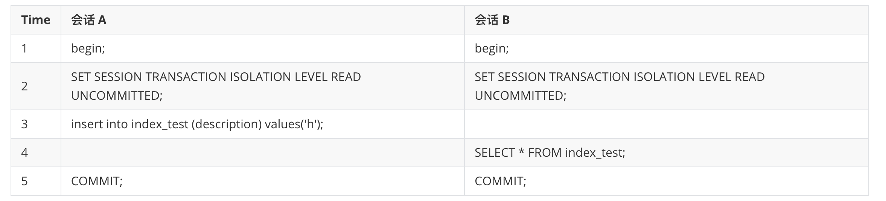

一个事务可以读取另一个事务未提交的数据。会话 A 中插入的数据，但是 `事务 A` 没有提交，但是 `事务 B` 读取到了插入的 h。

#### 不可重复读

不可重复读是指在一个事务内多次执行同一个 SQL，但是别的事务的 DML 操作事务提交之后，导致当前事务多次读取的数据集合不一致。

不可重复读和脏读的区别是，脏读是读取到了事务未提交的数据，而不可重读读到的是事务提交之后的数据。

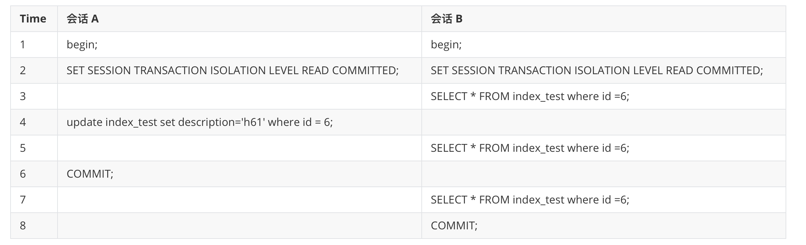

由于 `会话 A ` 在 Time=4 更新了 id =6 的数据， `会话 B` 在同一个事务内在 Time=3 和 Time=5 读取的数据一致，但是 Time=7 读取的数据和之前读取到的数据不一致。

#### 幻读

幻读指的一个事务读取到另一个事务新插入的行（另一个事务提交了）。这个说话比较容易理解。

<font color=red>敲黑板，重点来了</font>

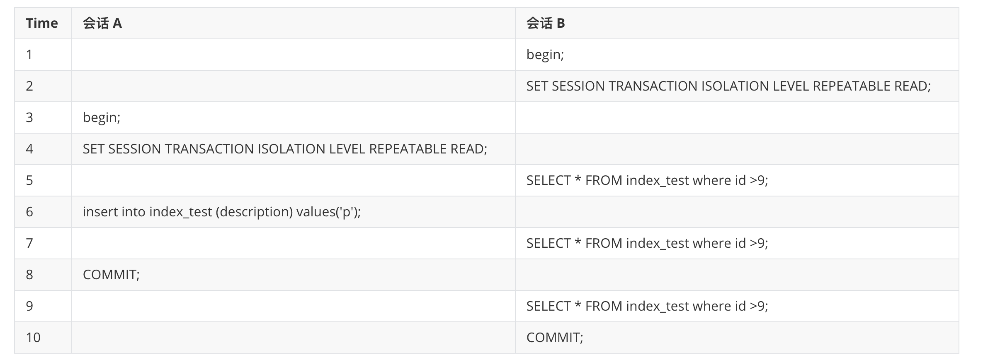

t5,t7,t9 读取的数据都是一致的。并没有出现幻读问题，这个 Mysql 的 MVCC 有关，<font color=red>但是 MVCC 解决不了幻读问题。</font>

Mysql 具有 `MVCC` 多版本并发控制（Multi version Concurrency Controller）的特性。它是指如果读取的行正在进行 UPDATE 或 DELETE 操作，这时读操作并不会阻塞等待当前行的 UPDATE 或 DELETE 操作完成，而是去读取当前行的一个快照。MVCC 通过 undo log 实现。

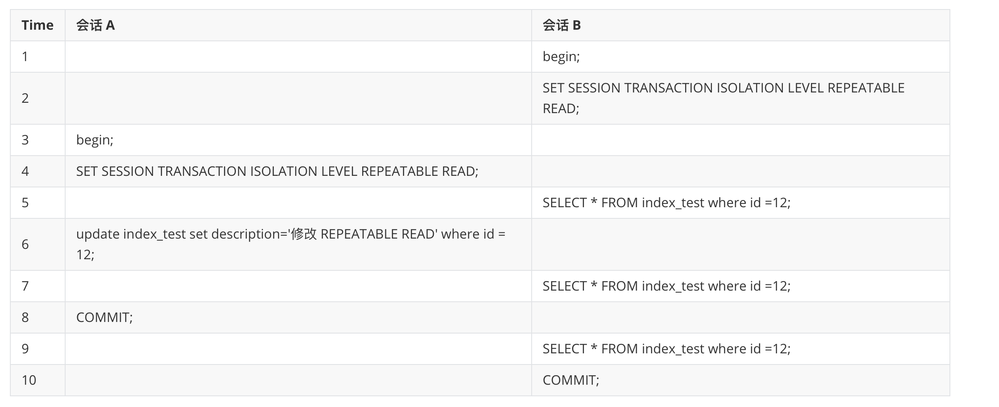

在隔离级别是 `可重复读` 的情况下，t5,t7,t9 读取的数据是一致的。

但是在隔离级别为 `读已提交` 的情况下，得到的结果就不一样了。

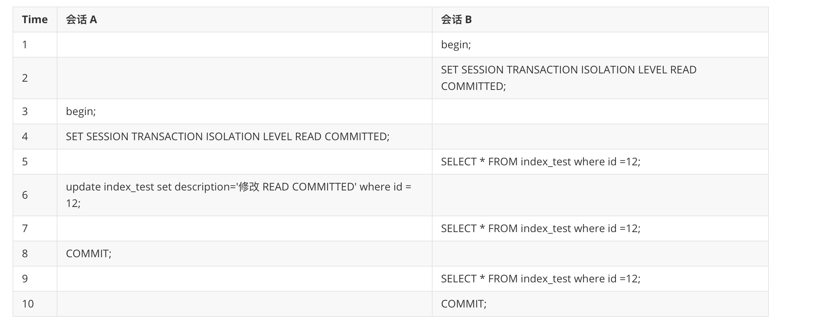

在 `读已提交` 的情况下，t5 和 t7 读取的是一样的数据，而 t9 读取到了最新的数据。


### 保存点

当我们开启一个事务之后，rollback 只能回滚某个事务。但是如果一个事务太多操作，我们只想回滚到具体的某个地方。就可以使用 保存点这个功能。

```sql
-- 创建某个保存点
SAVEPOINT 保存点名称;

-- 回滚到具体某个保存点
ROLLBACK TO 保存点名称;

-- 删除某个保存点
RELEASE SAVEPOINT 保存点名称;
```

```sql
-- 开启一个事务
begin;

-- 查询 id 为 1 和 2 的数据
select * from index_test where id in (1,2);

+----+-------------+
| id | description |
+----+-------------+
|  1 | 1           |
|  2 | h6          |
+----+-------------+

-- 更新 id 为 1 的数据，并保存保存点
update index_test set description ='t1' where id =1;
savepoint t1;

-- 验证数据更新了，因为实在同一个事务，所以是可以查看到的
select * from index_test where id in (1,2);
+----+-------------+
| id | description |
+----+-------------+
|  1 | t1           |
|  2 | h6          |
+----+-------------+

-- 更新 id =2 的数据，并保存保存点
update index_test set description ='t2' where id =2;
savepoint t2;

-- 验证数据更新了，因为实在同一个事务，所以是可以查看到的
select * from index_test where id in (1,2);
+----+-------------+
| id | description |
+----+-------------+
|  1 | t1          |
|  2 | t2          |
+----+-------------+

-- 回滚到具体的某个保存点
rollback to t1;
select * from index_test where id in (1,2);
+----+-------------+
| id | description |
+----+-------------+
|  1 | t1           |
|  2 | h6          |
+----+-------------+

-- 回滚某个保存点之后，t2 保存点丢了，当你回滚 t2 报错。
rollback to t2;
-- ERROR 1305 (42000): SAVEPOINT t2 does not exist

commit;
```


## 锁


### server 层的锁

### Metadata Locks

如果我们对表进行 DDL 修改表结构，server 层会添加 Metadata Locks，DML 语句会阻塞等待。


### InnoDB 中的锁

Java 中要想保存数据的一致性一般我们都会使用锁，同理 Mysql 也是使用锁来实现了事务。

InnoDB 实现了两种行级锁：共享锁和排它锁。

InnoDB 内部也有意向锁，由 InnoDB 自动添加。意向锁为表级锁。

- 意向共享锁，英文名：`Intention Shared Lock`，简称`IS锁`。当事务准备在某条记录上加`S锁`时，需要先在表级别加一个`IS锁`。
- 意向独占锁，英文名：`Intention Exclusive Lock`，简称`IX锁`。当事务准备在某条记录上加`X锁`时，需要先在表级别加一个`IX锁`。

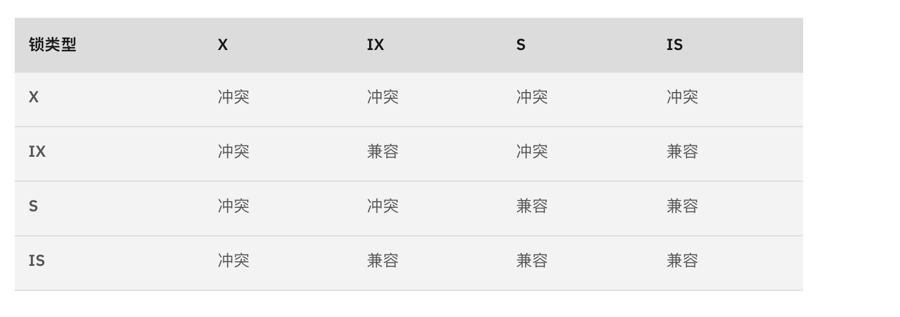

IS、IX锁是表级锁，它们的提出仅仅为了在之后加表级别的S锁和X锁时可以快速判断表中的记录是否被上锁，以避免用遍历的方式来查看表中有没有上锁的记录，也就是说其实IS锁和IX锁是兼容的，IX锁和IX锁是兼容的。

### 共享锁（S Lock）

```sql
-- 手动加 s 锁
select * from tableName  lock in share mode;
```

### 排它锁（X Lock）

```sql
-- 手动加 x 锁
select * from tableName  for update;
```

事务提交之后锁就释放了。S 锁和 S 锁是 **兼容** 的，X 锁和其它锁都 **不兼容** 。不兼容的锁需要等待另一个锁释放。

DELTE、UPDATE、INSERT 数据库默认会给我们添加排它锁。

### 共享锁和排它锁演示

#### 共享锁

事务 A 获取 id=1 的 s 锁，事务 B 也获得了 id=1 的 s 锁。两个事务是不需要阻塞等待另一个事务结束的。

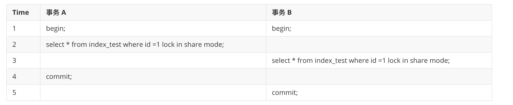

#### 排它锁

事务 B 阻塞等待事务 A 提交，当事务 A commit 之后，事务 B 的更新语句才能完成。

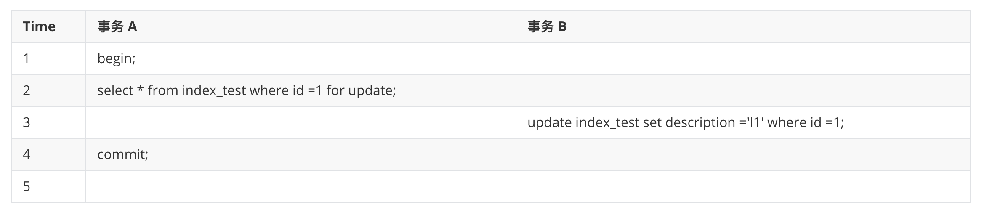


### 锁的算法

InnoDB 存储引擎有 3 种锁的算法，分别是

-   Record Lock，锁的是当行
-   Gap Lock ，锁的是一个范围，但是不包括当前行
-   Next-Key Lock ，锁定是记录本身及之间的间隙

Mysql 事务隔离级别为 `重复读` 采用 Next-Key Lock 算法加锁。隔离级别为 `读已提交` 采用 Record Lock 算法加锁。

#### 解决幻读问题

| Time | 事务 A                                                   | 事务 B                                                   |
| ---- | -------------------------------------------------------- | -------------------------------------------------------- |
| 1    | begin;                                                   | begin;                                                   |
| 2    | SET SESSION TRANSACTION ISOLATION LEVEL REPEATABLE READ; |                                                          |
| 3    |                                                          | SET SESSION TRANSACTION ISOLATION LEVEL REPEATABLE READ; |
| 4    | select \* from index_test where id >1 for update;        |                                                          |
| 5    |                                                          | insert into index_test (id,description)values(3,'adfa'); |
| 6    | commit                                                   |                                                          |
| 7    |                                                          | 插入语句执行成功                                         |
| 8    |                                                          | commit;                                                  |

事务 A 加了 X 锁，由于事务的隔离级别为 `重复读`，采用的是 Next-Key Lock，锁定的是主键大于 1 的范围，当事务 B 执行插入操作时，会阻塞等待事务 A 完成或者锁超时，事务 B 插入语句报错。

### 锁的使用场景

1、比如下单买东西的业务。

小明买 id=1 的商品，同时小张也下单买 id=1 的商品，但是这个商品的库存量目前是 1。

实现的大致逻辑是这样，但是会发生超卖现象。

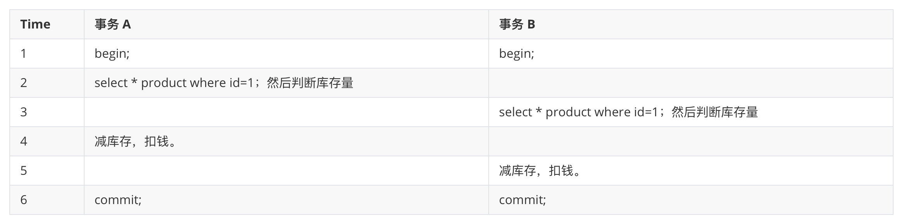

#### 悲观锁解决超卖问题

解决这个问题也比较简单，加互斥锁。这样检查商品的时候，同时只有一个人能查询。当事务 B 阻塞获取 id=1 的 x 锁超时会抛出异常。

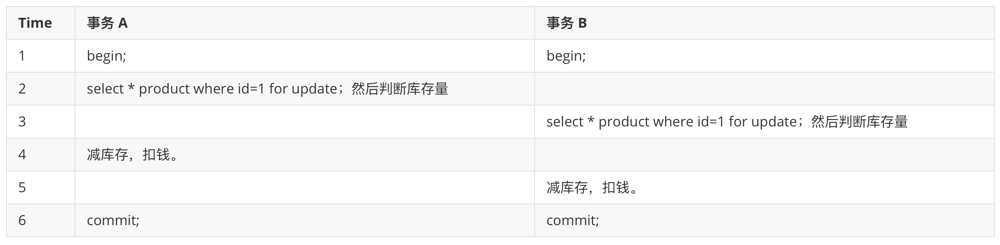

以上是悲观锁解决超卖问题，但是排他锁之间是互斥的，同一时间只能有一个人可以购买商品，后续的人全部都阻塞在事务 B t3 哪里等待锁的释放，这大大降低了程序的并发。

#### 乐观锁解决超卖问题

乐观锁其实就是类似于 java 中 cas。我们在表中添加一个字段 version。

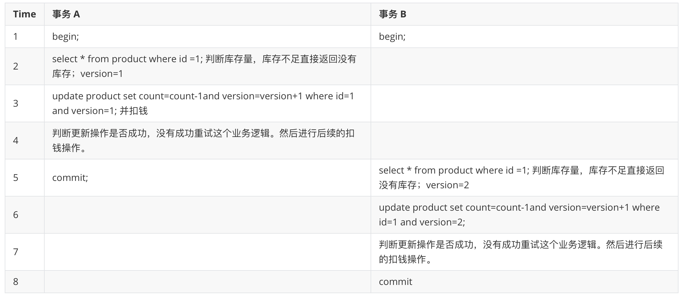

重试操作，可以使用 Spring-retry 这个框架进行，一个注解搞定，很方便。

使用乐观锁之后，100 个用户可以并发的进行修改，其中可能 30% 的人可能一次就付款成功。剩余的 70 人接着重试去购买，这相对于悲观锁来说并发会提高不少。

但是如果系统 TPS 很大，每次只有 10% 甚至更低的人购买成功，还是考虑用悲观锁实现吧。
