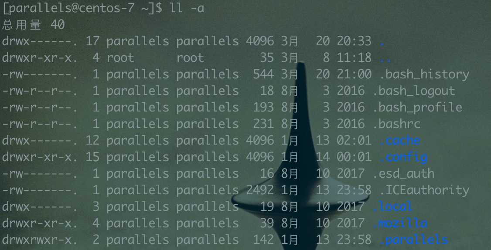

## Linux 简介

Linux 内核最初是由 Linus Torvalds 开发维护的。
Linux 能运行主要的 UNIX 工具软件、应用程序和网络协议。它支持 32 位和 64 位硬件。
Linux 继承了 Unix 以网络为核心的设计思想，是一个性能稳定的多用户网络操作系统。
Linux 的发行版说简单点就是将 Linux 内核与应用软件做一个打包。

可选的有 Debian，Ubuntu，服务器部署选择 Debian 吧。

在 Linux 中，一切皆文件。所以各种目录、文件的权限、创建者、所属组都是比较实用的东西。


## Linux 目录介绍


### 根目录-`/`

根目录下面有许多子目录 `bin` `etc` `home` `opt` `usr` `sbin` `var` `tmp` 等等。

### `/root`

是用户 `root` 的家目录。

### `/home`

除 `root` 用户之外的其它的用户家目录。`cd ~` 就是进入当前用户的家目录。

### `/bin`

`/bin` 是一些二进制的执行文件, 也可能是软连接。

### `/sbin`

`s` 指 Spuer user。

`/sbin` 是一些二进制的执行文件, 也可能是软连接，管理员可执行的命令。

### `/etc`

`/etc` 为配置文件所在路径。比如 `/etc/nginx` 存放 `nginx` 的配置文件。

### `/usr`

`usr` 为 `unix system resources` 简写。表示系统资源的路径。

#### `/usr/bin`

所有用户的都可访问的二进制命令，不包括系统管理员的命令。

#### `/usr/share`

包含共享数据。比如 `/usr/share/nginx` 为 nginx 存放的静态资源。

#### `/usr/local`

从源码编译安装的程序安装到这里。

#### `/usr/src`

系统内核 `kernel` 源码位置。

### `/var`

程序运行产生的缓存文件，锁文件，pid 文件，日志文件等会在这个目录，一些经常会变化的内容保存的位置。


## 命令执行的优先级

我们经常用 `pwd` 获取当前目录路径，如果我自己写个 shell 脚本，命名为 `pwd`,将其加入到 `PATH` 中，那二者谁会执行呢？

这就是为什么要了解命令的优先级了。

### 命令优先级

第一优先级：指定路径的命令。绝对路径 `/home/parallels/a.sh` 或者相对路径 `./a.sh`。

第二优先级：别名指定的命令 `alias pwd=/home/parallels/a.sh`

第三优先级：内部命令(pwd)

第四优先级：hash 命令

第五优先级：通过 `PATH` 定义的查找顺序查找

如果以上顺序都找不到，就会报 `未找到命令...` 的错误。

通过 `type command` 可以查看 command 命令类型。

```bash
# clear 已被哈希 (/usr/bin/clear)，clear 哈希命令
type clear


# pwd 是 shell 内嵌。pwd 是内嵌命令。
type pwd


# java 是 /usr/bin/java，java 是通过 PATH 寻找到的命令。
type java
```

`alias pwd=/home/parallels/a.sh` 通过改写 `pwd`。

```bash
# a.sh
echo 11
```

当我执行 `pwd` 的时候，命令运行的是 `a.sh`


## PATH

### PATH 生效的原理

<font color=red>启动终端的时候会初始化命令，会加载 `/etc/profile` 和 `~/.bash_profile` </font>

`/etc/profile` 会将路径加载`/usr/local/bin` 、`/usr/bin`、`/usr/local/sbin` 、`/usr/sbin` 追加到 PATH 中去。然后将 `/etc/profile.d/*.sh` 进行初始化。

`~`对应当前登录用户的用户空间。比如我用 `flyu` 操作当前 shell，那么`~` 等于 `/home/flyu`

`~/.bash_profile` 会判断 `~/.bashrc` 存在吗，存在会运行它。

`~/.bashrc` 中会判断 `/etc/bashrc` 存在吗，存在会运行它。

`/ect/bashrc` 将 `/etc/profile.d/*.sh` 进行初始化。


### PATH 全局配置

基于以上的理解，<font color=red>全局命令配置建议直接在 `/usr/bin`下建立软连接到你的可执行文件。</font>

不要想着在 `/etc/profile.d/` 下写脚本进行配置 PATH。当脚本写错，那么你可能会配置 `PATH` 的有效性，


### PATH 用户配置

用户配置 PATH 直接在 `~/.bashrc` 中追加 PATH 即可。

```bash
PATH="${PATH}:/usr/local/aa"
export PATH
```

一般我们用 `yum` 安装环境已经给配置好了环境变量。


## 用户管理

linux 下`用户`、`组`创建和管理。可以控制哪些`目录`和`文件`可以访问。

```bash
# 创建 mflyyou 用户,同时会创建 mflyyou 组
adduser mflyyou
```

```bash
# 修改 mflyyou 的密码，命令之后会提示你输入密码
passwd mflyyou
```

创建的用户是不具有 `sudo` 提升权限的能力，需要修改 `/etc/sudoers` 使之生效。

```bash
# 在 root 下运行，修改文件的可写性
chmod  700 /etc/sudoers

# /etc/sudoers 文件中填写 mflyyou ALL=(ALL)      PASSWD:ALL
root    ALL=(ALL)       ALL
mflyyou ALL=(ALL)      PASSWD:ALL


# 权限给了之后，修改文件 /etc/sudoers 为只读性
chmod  400 /etc/sudoers
```


## 文件权限控制



每行信息开头的第一个字母表示文件类型。

`d` 表示目录。

`-` 表示文件。

`l` 表示软连接。

`mkdir` 创建目录。

`touch` 创建空文件。

对文件夹或文件划分权限。 4 读 r，2 编辑 w,1 执行 x

```
chmod 754 /opt/config
```

修改 /opt/config 所属用户、用户组、其它人的访问权限。

-   所属用户：读、编辑、执行，7

-   所属组：读、执行，5

-   其他：读，4

修改文件夹或者文件的所属用户和用户组

```
# 递归修改 /opt/config 的归属 admin 用户，所属 admin 组
chown -R admin:admin  /opt/config
```


## 常用命令

`linux` 的命令不用刻意记，`-h` `-?` `man` 都可以查看命令的帮助信息。

```bash
# man，查看系统内置的命令
man find

# -h -? 一般是程序的帮助信息
nginx -h
```

### 基本命令

```bash
# 查看一个文件新生成内容，动态观看

tail -f -n 10 a.txt

# 有的时候，两个命令执行有 依赖关系 ，a 执行成功执行 b

a && b

# a 执行成功与否，b 都要执行

a || b
```

### scp-远程拷贝

```bash
# 将 a 目录下的所有资源 拷贝到指定远程地址的 /usr/share/nginx/html/ 下
scp -rp /a/* 用户名@ip:/usr/share/nginx/html/
```

### grep-查询文本

用于查询内容中符合指定格式的内容。

```bash
# 不查询指定命令
grep -v

# 忽略大小
grep -i

ps -ef | grep jail-2.0-0.0.1-SNAPSHOT.jar | grep -v grep
```

### awk-操作文本

对文本根据 `空格` 或者 `tab` 切割，然后根据操作获取符合条件的某行中某列的数据。

`$n` 获取第几个内容，`$0` 获取当前行，`$NF` 获取最后一个字段

```bash
# a2
echo "a1 a2 a3" | awk '{print $2}'

# a3
echo "a1 a2 a3" | awk '{print $NF}'

# a2
echo "a1 a2 a3" | awk '{print $(NF-1)}'
```

awk 还提供一些内置函数。其余的内置函数可以查看帮助命令。

-   `toupper()`：字符转为大写。
-   `tolower()`：字符转为小写。
-   `length()`：返回字符串长度。
-   `substr()`：返回子字符串。

```bash
# A2
echo "a1 a2 a3" | awk '{print toupper($2)}'

# a2
echo "A1 A2 A3" | awk '{print tolower($2)}'

# 9
echo "A1 123456789 A3" | awk '{print length($2)}'

#
echo "A1 123456789 A3" | awk '{print substr($2)}'
```

指定分隔符使用。

```bash
# A2
echo "a1:a2:a3" | awk -F: '{print toupper($2)}'
```

使用条件进行筛选。

log.txt

```txt
a1 a2 a3 a4
bb1 bb2 bb3 bb4
ccc1 ccc2 ccc3 ccc4
```

```bash
# 获取每行第一列内容
awk '{print $1}' a.txt

# 获取每行第一列，字符长度大于 2 的，只有第二和第三行的打印出来了。bb1,ccc1
awk 'length($1) > 2 {print $1}' a.txt
```

### sed-操作文本

也是一个比较厉害的操作文本的命令。可以用于替换文件中的内容，删除或新增内容，搜索符合条件的内容

```bash
# 将 a 替换为 ，
echo "a1b2c1" | sed s/a/,/g

# 比如我们在本地部署集群的时候，批量生成配置文件
sed s/6379/6380/g redis.conf > redis_6380.conf
```

### find-查询文件

```bash
# find  path  option ;

# 查询某个路径下的名称为 a.sh，这里会查出文件和目录
find / -name "a.sh"

# 指定查询 文件（f）或者目录(d)

find / -name "a.sh" -type f
```
