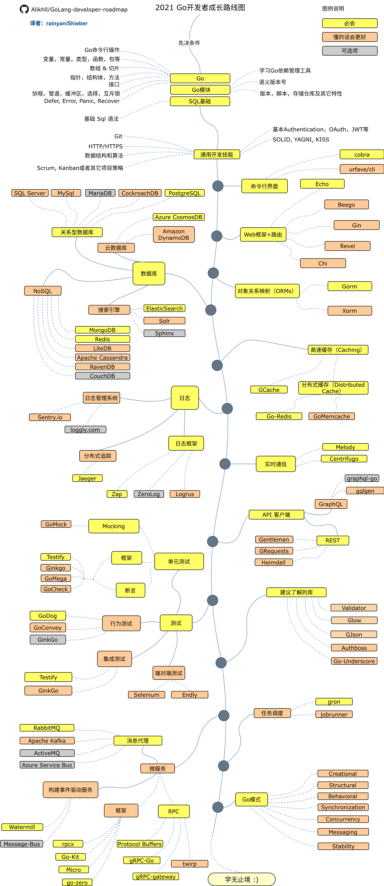

### 记录学习内容

- Go 基础
- go 模块
- 测试 Testify gomock
- 并发编程
- 网络通信
- echo 
- Gcache 和 Go redis
- 最后提升代码功底，https://github.com/zhangpanqin/go-patterns
- cobra

学习代码记录地址：https://github.com/zhangpanqin/fly-go

# Go 开发者路线图

引用 https://github.com/Alikhll/golang-developer-roadmap

