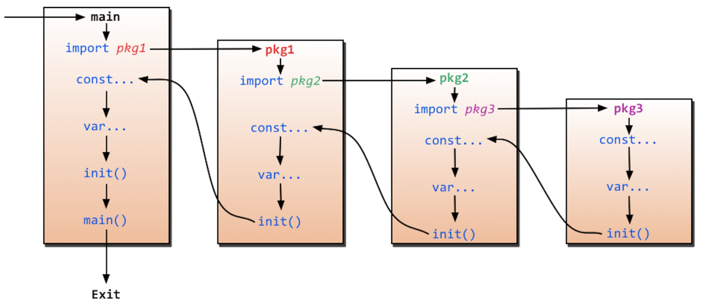

## init 函数

go 语言中 `init` 函数用于包 `(package)` 的初始化，该函数是 go 语言的一个重要特性。

-   init 函数是用于程序执行前做包的初始化的函数，比如初始化包里的变量等

-   每个包可以拥有多个 init 函数

-   每个源文件也可以拥有多个 init 函数
-   对同一个 go 文件的 `init()` 调用顺序是从上到下的。

```go
package main

import "fmt"
import "fly-go/sample"

func init() {
	fmt.Println("init 1")
}

func init() {
	fmt.Println("init 2")
}

func main() {
	sample.Demo()
	fmt.Println("main")
}

/*
sample init 1
sample init 2
init 1
init 2
Demo
main

Process finished with the exit code 0
*/
```

```go
package sample

import "fmt"

func init() {
	fmt.Println("sample init 1")
}

func init() {
	fmt.Println("sample init 2")
}

func Demo() {
	fmt.Println("Demo")
}
```

## main 函数

Go 程序运行的主函数，package 必须是 main
