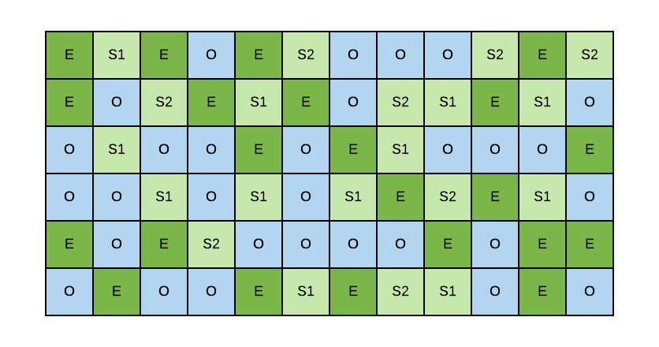
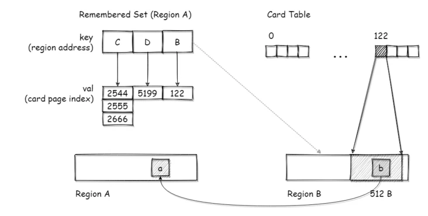

# G1

### G1 简介



G1 将堆划分为不连续空间的 region，region 是 G1堆和操作系统交互的最小管理单位。

G1的 region 大致可以分为四类：

- 自由分区（Free Heap Region，FHR）
- 年轻代分区（Young Heap Region，YHR），年轻代分区又可以分为 Eden 和 Survivor
- 老年代分区（Old Heap Region，OHR）
- 大对象分区（Humongous Heap Region，HHR），大对象分区又可以分为：大对象头分区和大对象连续分区。对象超过 region 的一半，就认为是大对象，直接分配到大对象区。


### G1 回收算法

G1 有三种回收算法：

- YGC，回收整个年轻代 region，
- Mixed GC，回收整个年轻代 region和部分老年代（可通过参数调节）
- Full GC，整个堆，serial old GC（ mark-compact）来对整堆收集一次


### G1 算法设计的概念

### Card 和 Card Table


G1 将堆划分为一个一个 card（512B，512 字节），然后 Card Table 是记录这个 card 中的对象有没有引用年轻代对象。每一位为 1 的时候，表明这个区域为 dirty，持有新生代对象，否则，这个区域不持有新生代对象。

Card Table 是个 bitmap（位图，数组），1G 的堆，需要 256KB 的 card table。

比如 a=b，a 是老年代独享，b 是新生代对象。记录的就是 a 所在 card 的索引，对应到 card table 值为 1。

这样，新生代垃圾收集器在收集live set 的时候，可以通过以下两个操作：

- 从栈/方法区出发，进入新生代扫描。
- 从栈/方法区出发，进入老年代扫描，且只扫描 dirty 的区域，略过其他区域。

#### RSet（Remember Set）

每个区域中都有一个 RSet，通过 hash 表实现，这个hash表的 key 是引用本区域的其他区域的地址，value是一个数组，数组的元素是引用方的对象所对应的 Card Page 在 Card Table 中的下标。



b=a，在 A 的 region 中 Rset 有一条记录， key 是 Region B 的地址，value 记录 b 在 card table 中的下标的数组。


```shell
java -XX:+UseG1GC -Xms4g -Xmx4g -XX:MetaspaceSize=256m -XX:MaxMetaspaceSize=256m -XX:+PrintFlagsFinal -version | grep Metaspace
```

G1 是一个响应时间优先的GC算法，它与CMS最大的不同是，用户可以设定整个GC过程的期望停顿时间。

G1根据这个模型统计计算出来的历史数据来预测本次收集需要选择的Region数量，从而尽量满足用户设定的目标停顿时间。 

### G1 jvm 参数设置

#### -XX:+UseG1GC

使用 G1


#### -Xms 和 -Xmx

```shell
-Xms2g -Xmx2g
```

**一定设置**，设置堆最小和最大内存。


- -Xss

设置线程栈大小，默认 1M（1.8 和 17）

```shell
-Xss2m
```


#### -XX:MetaspaceSize 和  -XX:MaxMetaspaceSize

```shell
-XX:MetaspaceSize=256m -XX:MaxMetaspaceSize=256m
```

元空间的大小，一般256M就足够了，不够再根据实际调整。


#### -XX:G1HeapRegionSize=n

```sh
-XX:G1HeapRegionSize=2M
```

设置 G1 中一个 region 多大，单位 M。2 的幂，范围 1-32，可取值：1,2,4,8,16,32


### -XX:MaxGCPauseMillis

```shell
-XX:MaxGCPauseMillis=300
```

MaxGCPauseMillis 默认值 200，gc 期望的最大垃圾收集停顿时间 200 ms。

这个会通过动态调整新生代大小，来达到预期最大暂停时间，不一定达到，尽量满足。


### -XX:InitiatingHeapOccupancyPercent

默认值是 45。

```shell
-XX:InitiatingHeapOccupancyPercent=60
```

设置 java 堆占用达到多少时，触发 Mixed GC。

较低的值可能导致更频繁的混合收集，从而降低吞吐量，但可以减少停顿时间。相反，较高的值可能会减少混合收集的频率，但可能增加停顿时间。


- ```
  -XX:G1MixedGCLiveThresholdPercent=65
  ```

  设置要包含在混合垃圾收集周期中的旧区域的占用阈值。默认占用率为 65%。这是一个实验性的标志。有关示例，请参阅“[如何解锁实验性 VM 标志](https://www.oracle.com/technical-resources/articles/java/g1gc.html#Unlock)”。此设置取代了该`-XX:G1OldCSetRegionLiveThresholdPercent`设置。此设置在 Java HotSpot VM build 23 中不可用。

- ```
  -XX:G1HeapWastePercent=10
  ```

  设置您愿意浪费的堆的百分比。当可回收百分比小于堆浪费百分比时，Java HotSpot VM 不会启动混合垃圾收集周期。默认值为 10%。此设置在 Java HotSpot VM build 23 中不可用。

- ```
  -XX:G1MixedGCCountTarget=8
  ```

  设置标记周期后混合垃圾收集的目标数量，以收集最多包含`G1MixedGCLIveThresholdPercent`实时数据的旧区域。默认是 8 次混合垃圾回收。混合收集的目标是在这个目标数量之内。此设置在 Java HotSpot VM build 23 中不可用。

- ```
  -XX:G1OldCSetRegionThresholdPercent=10
  ```

  设置混合垃圾收集周期期间要收集的旧区域数量的上限。默认值为 Java 堆的 10%。此设置在 Java HotSpot VM build 23 中不可用。

- ```
  -XX:G1ReservePercent=10
  ```

  设置保留空闲内存的百分比，以降低空间溢出的风险。默认值为 10%。当您增加或减少百分比时，请确保将 Java 堆总量调整相同的量。此设置在 Java HotSpot VM build 23 中不可用。


### -XX:G1ReservePercent

`G1ReservePercent` 参数指定了堆空间预留给 G1 垃圾收集器的一部分内存的百分比。这个预留的内存不会被应用程序直接使用，而是由 G1 垃圾收集器在运行时使用。防止to-space。


#### -XX:G1NewSizePercent 和  -XX:G1MaxNewSizePercent

G1NewSizePercent 默认：5。

G1MaxNewSizePercent 默认：60。

**一般不需要设置**。设置的是新生代初始化和最大大小，应为 G1 预测模型会动态调整，一般不修改。

```shell
-XX:+UnlockExperimentalVMOptions -XX:G1NewSizePercent=3
```

G1年轻代的大小，按照经验一般保证在800M~1G，太大容易导致单次 young GC 的时间太长，太小又增加频率。1g 差不多能保证每次GC在 100ms 的时间。当我们的堆比较大的时候，我们可以调整这个值。

### -XX:-ResizePLAB


### G1 重要可以不修改参数

### -XX:GCPauseIntervalMillis

GCPauseIntervalMillis 默认是 MaxGCPauseMillis + 1。

gc 间隔时间，GCPauseIntervalMillis 必须大于 MaxGCPauseMillis。


### -XX:GCTimeRatio = n

```shell
-XX:GCTimeRatio=12
```

GCTimeRatio 用来指定应用程序线程的执行时间与垃圾收集线程执行时间的比率。

这个值影响的是吞吐量。

Jdk 1.8 默认 9。

jdk 17 默认 12。 

当为 9 时，意味着 gc 执行时间占 `1/(9+1) ` =10% 。

当为 12 时，意味着 gc 执行时间占 `1/(12+1)` = 7.69% 。

增大这个值，意味着 gc 占用时间减少，由于垃圾收集所占用的时间相对减少，垃圾收集的频率可能会降低。这意味着每次垃圾收集的停顿时间可能会更长，但是在整体上，应用程序的运行时间可能会更长。

服务端我们一般追求的是低延迟，所以我们更关注的是 MaxGCPauseMillis。


### -XX:ParallelGCThreads

初始化标记阶段和重新标记阶段，这个阶段 STW，只有 GC 线程执行，设置并行 GC 线程的数量。

在未明确指定的情况下，JVM会根据**逻辑核数 **ncpus，采用以下公式来计算默认值：

- 当 ncpus 小于8时，ParallelGCThreads = ncpus
- 否则 ParallelGCThreads = 8 + (ncpus - 8 ) ( 5/8 )


### -XX:ConcGCThreads

并发标记阶段，gc 运行的线程数量。默认为 **ParallelGCThreads** 的  1/4 。这个时候，GC 线程和用户应用线程一起工作，这个值，不要太大。否则影响用户线程执行。


### G1 不推荐设置 jvm 参数

G1 有个预测模型，根据你的期望暂停时间，动态调整年轻代大小。

因此，不需要设置：MaxNewSize，NewSize，Xmn，NewRatio


https://www.oracle.com/technical-resources/articles/java/g1gc.html