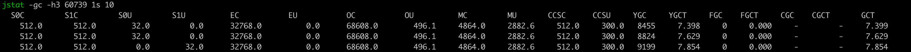
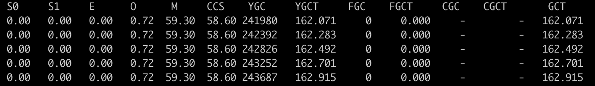

## JVM 参数查看

```shell
# 可以查看 jvm 默认配置，例如 size_t MaxHeapSize = 130862280 {product} {default}
java -Xmx200m -XX:+PrintFlagsInitial -version

# 命令行参数，影响了 jvm 配置 size_t MaxHeapSize = 209715200  {product} {command line}
java -Xmx200m -XX:+PrintFlagsFinal -version
```


### arthas-强烈建议学会

Arthas 是一款线上监控诊断产品，通过全局视角实时查看应用 load、内存、gc、线程的状态信息，并能在不修改应用代码的情况下，对业务问题进行诊断，包括查看方法调用的出入参、异常，监测方法执行耗时，类加载信息等，大大提升线上问题排查效率。

[arthas](https://arthas.aliyun.com/doc/)


### jps

Java 提供的一个显示当前所有 java进程 pid的命令

```shell
# -l 显示类名称 -m 显示传给 main 的参数 -v 显示传给虚拟机的参数
jps -l
jps -lmv
```


### jinfo

用于显示 java 进程的 vm 配置 和 Java System Properties。或者修改某项 vm 配置

```shell
# 打印 VM flags and system properties
jinfo <pid>

# to print the value of the named VM flag ，-flag <name>
jinfo -flag OldSize 60739
#  to enable or disable the named VM flag，-flag [+|-]<name>   

```


### jstack

用于生成 java 进程中所有线程的堆栈信息，用于诊断死锁及线程阻塞等问题。

```shell
jstack 40695
```


### jmap

jmap：Java虚拟机自带的命令行工具，可以生成JVM中堆内存的Dump文件，用于分析堆内存的使用情况。排查内存泄漏等问题。

```shell
# dump 成文件，包队 class 信息和堆信息
jmap -dump:live,format=b,file=heap.bin <pid>


# 打印 java 对象占用信息
jmap -histo:live,file=/tmp/histo.data <pid>
```


### jhat

使用 **jmap** 可以生成 Java 堆的 dump 文件，使用 jhat 命令将dump文件转成 html 的形式然后创建了 server，然后通过 http 访问可以查看堆情况。

将 dump 文件下载到本地使用 [VisualVM](https://github.com/oracle/visualvm) 分析。

### jstat

jstat：查看 Java 虚拟机 gc 命令。

```shell
jstat -<option> [-t] [-h<lines>] <vmid> [<interval> [<count>]]

# 查看支持的 option
jstat -options 
```

::: tips

**C** 结尾代表 capacity 或者 count，表示某个指标的容量或次数。

**U** 结尾代表 use，表示使用了多少。

**T** 结尾代表 time，表示用时。

:::


- **jstat -gc**

```shell
# 隔 1s 打印 gc 信息，打印 gc 次数，每 5 行打印头信息
jstat -gc -h5 60739 1s 10
```



可以看到 s0,s1,eden,old,meraspace 多大，用了多少。还可以看到 gc 的次数和发生事件。总共 gc 次数和 gc 时间。

- **jstat -gcutil**

查看 s0,s1,eden,old,meraspace 使用百分比及 gc 次数和时间。

```shell
jstat -gcutil -h5 60739 1s 10
```



