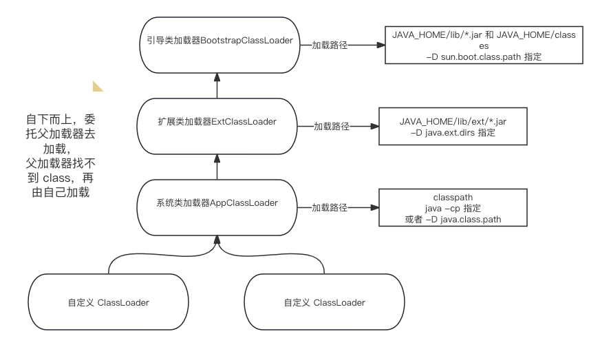
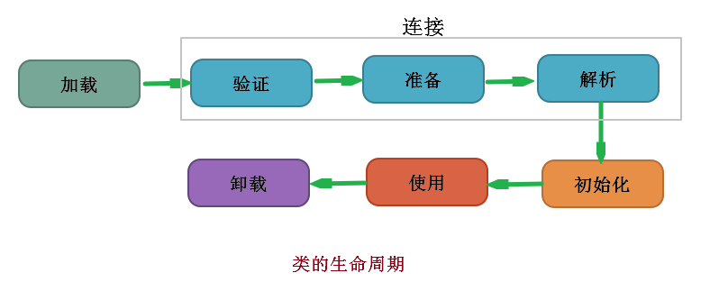

# Java 类加载器

::: warning
JDK 环境：  1.8
:::


## 类加载器介绍

```java
public class Main {
    public static void main(String[] args) {
        // sun.misc.Launcher$AppClassLoader
        System.out.println(Main.class.getClassLoader());
        // sun.misc.Launcher$ExtClassLoader
        System.out.println(Main.class.getClassLoader().getParent());
        // null 实际是 BootstrapClassLoader
        System.out.println(Main.class.getClassLoader().getParent().getParent());
        // null 实际是 BootstrapClassLoader
        System.out.println(ArrayList.class.getClassLoader());
    }
}
```


```java
public static void main(String[] args) {
  // JAVA_HOME
  System.out.println(System.getProperty("java.home"));
  // BootstrapClassLoader 加载的路径: JAVA_HOME/lib/*.jar 和 JAVA_HOME/classes
  System.out.println(System.getProperty("sun.boot.class.path"));
  // ExtClassLoader 加载的路径: JAVA_HOME/lib/ext/*.jar
  System.out.println(System.getProperty("java.ext.dirs"));
  // AppClassLoader 加载的路径: classpath
  System.out.println(System.getProperty("java.class.path"));
}
```



### 双亲委派机制

双亲委派模型并不是一种强制性的约束。而是官方推荐的一种方式。

当我需要遵循双亲委派机制，我们实现 `findClass(String name)` 。

当我们<font color=red>不需要</font> 双亲委派机制，我们实现 `loadClass(String name) `。


`Tomcat` 打破了双亲委派机制，为了实现每个 web 应用加载同个 jar 的不同版本。


## 类加载过程



### 加载

**加载阶段** 主要定义从哪里加载我们的 class 文件二进制流。

如果我们自定义了类加载器，我们可以定义从任意地方加载我们的 `class` 文件。

- 定义从网络下载 class 文件字节流。
- 定义class 字节流的加密解密，比如说：私钥加密，公钥解密 class 字节流。

```java
ClassLoader loader = new NetworkClassLoader(host, port);
Object main = loader.loadClass("Main", true).newInstance();


class NetworkClassLoader extends ClassLoader {
          String host;
          int port;
 
          public Class findClass(String name) {
              byte[] b = loadClassData(name);
              return defineClass(name, b, 0, b.length);
          }
 
          private byte[] loadClassData(String name) {
              // load the class data from the connection
          }
}
```

### 连接

**连接阶段** 主要是保证 class 符合规范，安全检查及初始化。

**验证阶段**：主要是为了 验证 class 文件规范及语法正确，

**准备阶段** ：初始化 `类变量`，先将 value 初始化为 0

```java
public static int value=111
```

**解析阶段**：主要是进行引用替换，设置类，字段，方法等在内存的地址。


### 初始化

执行我们写的 Java 代码进行初始化。一个是类初始化，一个是成员变量初始化。

1. 当类第一次加载的时候，执行类初始化。new 一个对象和反射调用的时候。

2. 初始化一个类，如果其父类还未初始化，则先触发该父类的初始化。

静态代码块和静态变量赋值都只在类加载的时候初始化。

```java
public class Main {

    private static final int aa1 = aa1();
    private static final int aa2;
    private int a;

    static {
        System.out.println("静态代码块");
        aa2 = 3;
    }

    public static int aa1() {
        System.out.println("静态方法赋值");
        return 1;
    }

    public Main() {
        System.out.println("构造方法");
    }

    public static void main(String[] args) {
        new Main();
        new Main();
    }
}
```


```
静态方法赋值
静态代码块
构造方法
构造方法
```

