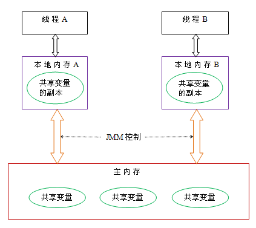

# 认识 Java 运行时数据区

Java 虚拟机在执行 java 程序的过程中会把它所管理的内存区域划分为不同的数据区域及 **Java 运行时数据区**。

::: warning

**Java 运行时数据区**不要和 **Java 内存模型**（JMM）混淆。

Java 内存模型定义了 JVM 在计算机内存(RAM)中的工作方式，java 内存模型指的是一套规范，规范线程如何访问内存。

::: 

## Java 内存模型

当程序在运行过程中，会将运算需要的数据从主存复制一份到CPU的高速缓存当中，那么CPU进行计算时就可以直接从它的高速缓存读取数据和向其中写入数据，当运算结束之后，再将高速缓存中的数据同步到主存。

因为 cpu 是多核，同一个数据可能会有多个线程或者进程访问，因此有要一些措施要保证缓存的一致性。

**Java 内存模型**就是规范 java  怎么去处理缓存一致性的。

比如 **volatile** 保证了可见性，Lock, synchronized 操作保证数据的可见性和原子性。

## Java 运行时数据区

**JVM 被分为三个主要的子系统**：

1. 类加载器子系统
2. 运行时数据区
3. 执行引擎

类加载子系统负责从文件系统或者网络中加载 Class 信息。

### PC 寄存器（线程私有）

java 虚拟机中每个线程都有自己的 pc 寄存器。在任意时刻，一条线程只会执行一个方法代码。如果执行的方法不是 native，那么 pc 寄存器就保存正在执行的字节码指令的地址。如果是执行的是 native 方法，pc 寄存器的值是 null。PC 寄存区也是唯一一个不会抛出 OOM 异常的区域。

### Java 虚拟机栈（线程私有）

每条线程都有自己的虚拟机栈，这个栈和线程同时创建，用于储存局部变量或者指向堆的指针。在 Java 虚拟机规范中，如果方法递归调用太深会抛出 StackOverflowError 异常；当无法申请足够的内存时也会抛出 OOM 异常。

-Xss 用于调节栈的大小。

### native 方法栈（线程私有）

调用 native 方法时使用的栈，了解即可。当栈溢出时，抛出 StackOverflowError 异常 ；当申请内存失败时，抛出 OOM 异常。

### 堆（线程共享）

堆（heap）是线程共享的区域，垃圾回收也主要回收它，我们主要也是堆打交道。-Xms 和 -Xmx 用于调整堆的大小。

### 方法区（线程共享）

方法区是是一个规范，在 jdk 1.8 具体的实现是**元空间** 。

方法区是线程共享的内存区域，它存储 Class 的结构信息。例如，运行时常量池、字段、方法、构造函数。方法区使用的是本地内存（堆外内存），相当于在系统上申请的内存。方法区会抛出 OOM。

-XX:MaxMetaspaceSize: 设置，默认 -1 不限制。

-XX:MetaspaceSize:指定元空间初始空间大小。字节为单位。
