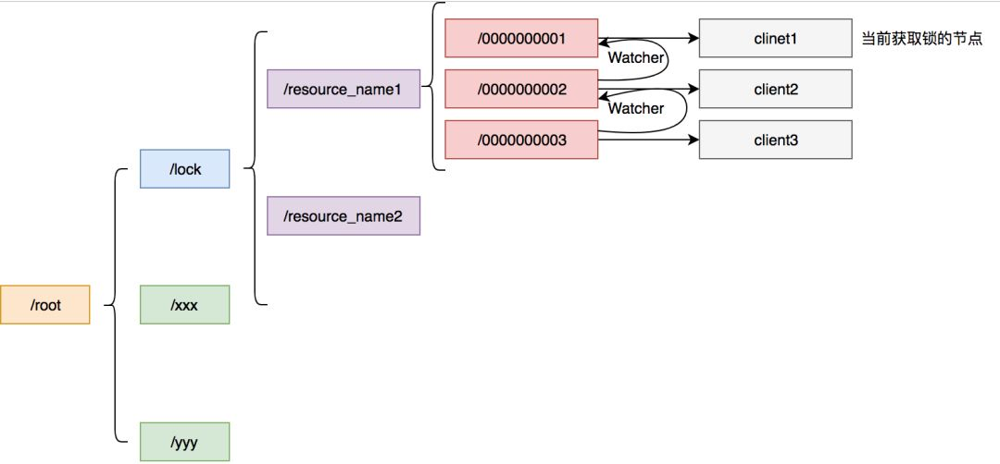

# 分布式锁

## Redis 分布式锁

可参考 [ Distributed locks and synchronizers · redisson/redisson Wiki](https://github.com/redisson/redisson/wiki/8.-distributed-locks-and-synchronizers#81-lock) 理解。


Redis 锁主要利用 Redis 的 setnx 命令。

- 加锁命令：SETNX key value，当键不存在时，对键进行设置操作并返回成功，否则返回失败。KEY 是锁的唯一标识，value 是线程 id。
- 解锁命令：DEL key，通过删除键值对释放锁，删之前要判断当前线程持有锁。
- 锁超时：EXPIRE key timeout, 设置 key 的超时时间，是为了避免死锁，当系统奔溃，未能显示解锁。

伪代码

```java
if (setnx(key, 1) == 1){
    expire(key, 30)
    try {
        xxx
    } finally {
        del(key)
    }
}
```

setnx 和 expire 是两条指令，不能保证原子性，使用 lua 操作，保证二者原子性。

redis 2.6.12 版本以上也提供了 `set（key，1，30，NX` 来保证原子性。

当获取的锁，没有超时时间。但是 redis 会设置 key 的过期时间，不能保证锁的互斥性。可以采取 watch dog （一个线程）去定时给这个 key 续期。

锁重入，可在 redis 中保存重入的次数，`set threaId 1` 然后往上加。


### 锁失效场景

1、主备切换导致锁的数据没有同步过来，新的 master 同时又可以被一个另一个进程获取锁，破坏了锁的互斥性。

2、集群脑裂，因为网络分区，sentinel 无法感知到 master，故障转移，将一个从节点提升为 master，导致集群出现两个 不同的master，新的 redis 链接也可获得同一把锁。

3、GC 停顿时间太长，GC 的时候 STW（stop-the-world）时间太长，导致锁过期，watch dog 没办法去延长过期时间。


## ZooKeeper 分布式锁 

ZK 的数据节点和文件目录类似，所以我们可以**临时顺序节点**实现分布式锁。




我们在锁的下面创建临时顺序节点，节点最小的那个客户端获取到锁。

解锁删除临时节点 01

锁超时，当创建这个锁的链接断掉，zk 会删掉这个临时节点。