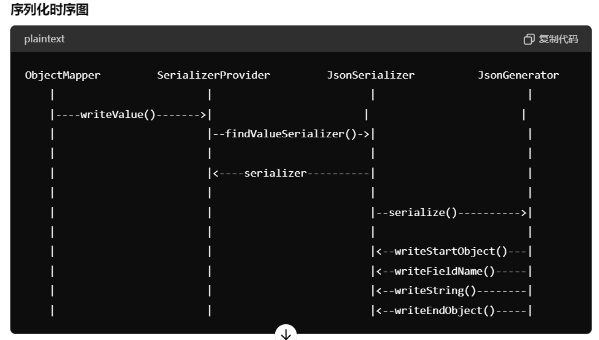
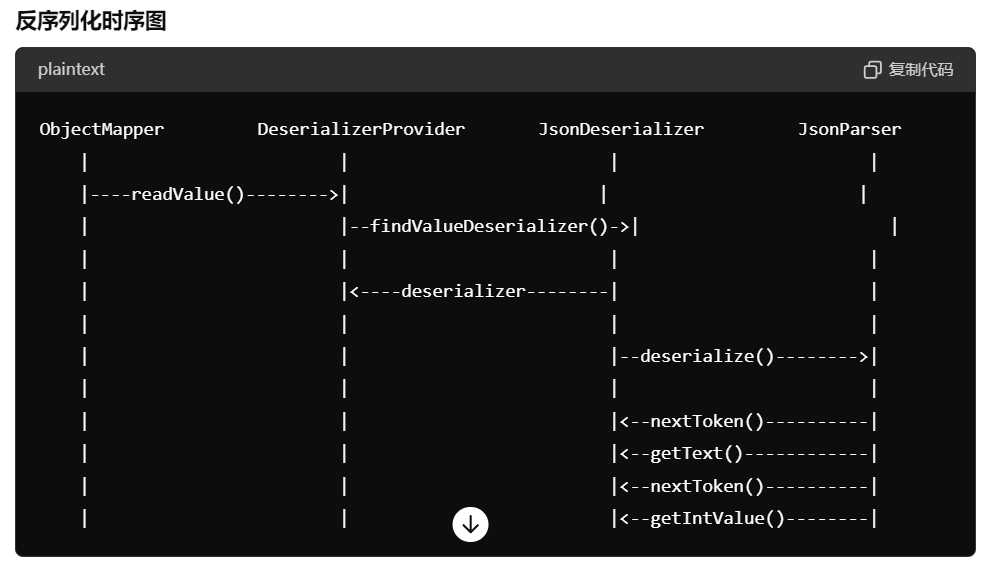

# Jackson

### 核心概念介绍

#### ObjectMapper

`ObjectMapper` 是 Jackson 的核心类，用于执行序列化和反序列化操作。它提供了大量的配置选项和方法来转换 JSON 和 Java 对象。

#### JsonParser 和 JsonGenerator

`JsonParser` 和 `JsonGenerator` 是 Jackson 的低级别 API，分别用于解析 JSON 和生成 JSON。这两个类提供了对 JSON 数据流的逐步读取和写入能力。

#### JsonNode

`JsonNode` 是一个树模型类，表示 JSON 数据的树状结构。通过 `ObjectMapper` 可以将 JSON 字符串解析为 `JsonNode`，或者将 `JsonNode` 序列化为 JSON 字符串。

####  Serializer 和 Deserializer

`JsonSerializer` 和 `JsonDeserializer` 是用于自定义序列化和反序列化逻辑的类。通过实现这些类，可以控制对象如何被转换为 JSON，以及 JSON 如何被转换为对象。

#### Module

Jackson 允许注册自定义模块 (`Module`)，这些模块可以包含自定义序列化器、反序列化器、混合类等。

#### BeanSerializerModifier

通过 `BeanSerializerModifier` 可以修改 Jackson 的序列化过程，例如更改属性的序列化器，添加或删除属性等。

### 序列化和反序列化过程





## 敏感数据，脱敏

1. 定义注解
2. 实现 AnnotationIntrospector 专门处理这个注解
3. 实现 JsonSerializer 去做数据脱敏
4. 实现一个Module 将这个模块注入到 Jackson

代码参考 [MyAnnotationIntrospectorModule](https://github.com/zhangpanqin/fly-jackson/blob/main/jackson-case/src/main/java/com/mflyyou/filter/MyAnnotationIntrospectorModule.java)


## Jackson 的使用

### JsonCreator

用于反序列化为对象，比如 SpringBoot 默认使用字面量，转换字符串到枚举。

如果我们想自定义转换，可以按一下操作

```java
@Getter
public enum SexEnum {
    BOY(1, "男"),
    GIRL(2, "女");

    SexEnum(Integer code, String desc) {
        this.code = code;
        this.desc = desc;
    }

    @JsonCreator(mode = DELEGATING)
    public static SexEnum of(@JsonProperty("code") Integer code) {
        for (SexEnum value : values()) {
            if (value.code.equals(code)) {
                return value;
            }
        }
        return null;
    }

    private final Integer code;
    private final String desc;
}
```

### JsonValue

制定序列化的字段
