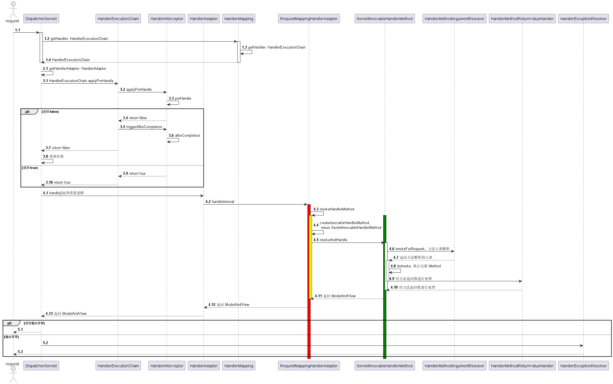

## Getting Started


DispatcherServletAutoConfiguration 自动创建了 DispatcherServlet Bean。


DispatcherServlet 继承了 ApplicationContextAware 和 EnvironmentAware。

为了注册 ConfigurableWebEnvironment 和 WebApplicationContext 属性到 DispatcherServlet。


当第一个请求到达 DispatcherServlet 会触发 Servlet 的初始化，init 方法执行，有且仅执行一次。


init -> onRefresh -> initStrategies

```java
protected void initStrategies(ApplicationContext context){

​    initMultipartResolver(context);

​    initLocaleResolver(context);

​    initThemeResolver(context);

​    initHandlerMappings(context);

​    initHandlerAdapters(context);

​    initHandlerExceptionResolvers(context);

​    initRequestToViewNameTranslator(context);

​    initViewResolvers(context);

​    initFlashMapManager(context);

​    }
```


ServletWebServerApplicationContext onRefresh 的时候，会 createWebServer，创建 TomcatStarter（ServletContainerInitializer

servlet 3.0 规范），绑定 Tomcat context。

TomcatStarter 的 onStartup 被回调，然后调用了 ServletContextInitializer onStartup。

DispatcherServletRegistrationBean 实现了 ServletContextInitializer。

DispatcherServletRegistrationBean 会将 DispatcherServlet 和 Tomcat 关联。

HandlerMethodArgumentResolver 方法入参解析。


### 参数解析

HandlerMethodArgumentResolver  负责参数解析。

在同一个项目中 `LocalDateTime` 如果既可以传 `yyyy/MM/dd HH:mm:ss` 又可以传 `yyyy-MM-dd HH:mm:ss`，那得多崩溃，也不好维护。

返回的 json 中日期格式如果也不固定，前端估计意见也挺大的。

我们可以实现 `Converter` 统一 `form/data` 和 `QueryString` 参数解析。

```java
// 然后将 WebMvcConfiguration 注册为 Spring 的 Bean
public class WebMvcConfiguration implements WebMvcConfigurer {
    @Override
    public void addFormatters(FormatterRegistry registry) {
        // form 表单个 query String 用下面的 convert 转换参数
        registry.addConverter(new String2InstantConverter());
        registry.addConverter(new String2LocalDateConverter());
        registry.addConverter(new String2LocalDateTimeConverter());
        registry.addConverter(new LocalDate2StringConverter());
    }
}
```

SpringBoot 使用 Jackson 将 request body 反序列化为 Java 对象，也使用 Jackson 将 java 对象序列化之后返回前端。

查看源码 `JacksonAutoConfiguration` 我们可以看到，通过实现 `Jackson2ObjectMapperBuilderCustomizer` 扩展 ObjectMapper

[Convert 代码预览](https://github.com/zhangpanqin/fly-spring-cloud/tree/master/cloud-common/src/main/java/com/mflyyou/cloud/common/convert)

[jackson 扩展代码预览](https://github.com/zhangpanqin/fly-spring-cloud/blob/master/cloud-common/src/main/java/com/mflyyou/cloud/common/CommonJacksonCustomizerAutoConfiguration.java)